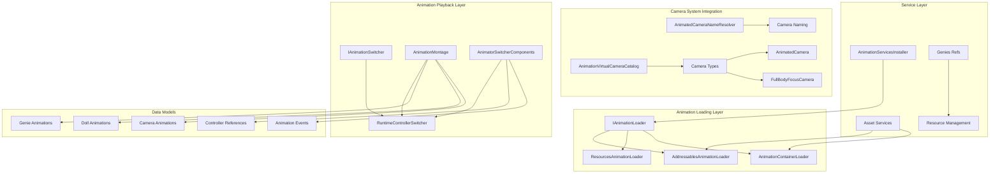
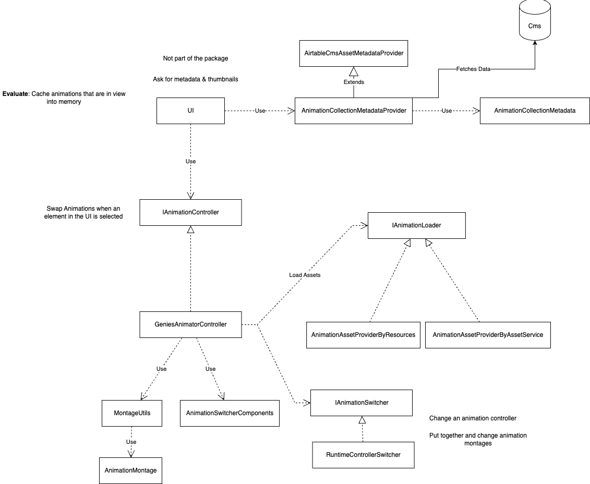

# Genies Animations Package Documentation

**Version:** 2.0.5  
**Unity Version:** 2022.3.32f1 or higher  
**Namespace:** `Genies.Animations`

## Overview

The **Genies Animations** package provides a comprehensive animation system for managing and playing animation sequences, montages, and camera animations within the Genies ecosystem. This package offers flexible animation loading strategies, sequenced animation playback, and seamless integration with Unity's animation system and Cinemachine cameras.

## Package Structure

```
Genies.Animations/
├── Runtime/
│   ├── AssetLoader/               # Animation loading strategies
│   │   ├── IAnimationLoader.cs    # Animation loader interface
│   │   ├── AddressablesAnimationLoader.cs  # Addressables-based loading
│   │   ├── ResourcesAnimationLoader.cs     # Resources-based loading
│   │   └── AnimationContainerLoader.cs     # Container-specific loading
│   ├── Switcher/                  # Animation switching and sequencing
│   │   ├── IAnimationSwitcher.cs  # Animation switcher interface
│   │   └── RuntimeControllerSwitcher.cs    # Controller-based switching
│   ├── Model/                     # Data models and components
│   │   ├── AnimationMontage.cs    # Animation montage data structure
│   │   └── AnimationSwitcherComponents.cs  # Switcher component configuration
│   ├── Camera/                    # Camera animation support
│   │   └── AnimationVirtualCameraCatalog.cs # Virtual camera types
│   ├── Animations/                # Built-in animation assets
│   ├── AnimationServicesInstaller.cs      # Dependency injection setup
│   └── AnimatedCameraNameResolver.cs      # Camera naming utility
└── Documentation/
    ├── Genies Animation.md       # This documentation
    └── images/
        └── AnimationPackageDesign.png    # UML architecture diagram
```

## Key Features

### 🎬 **Animation Loading System**
- Multiple loading strategies: Addressables, Resources, and Container-based
- Asynchronous loading with proper resource management
- Reference-counted memory management for loaded assets
- Batch loading support for animation sequences

### 🔄 **Animation Switching & Montages**
- Sequence-based animation playback through montages
- Runtime animator controller switching
- Smooth transitions between animation clips
- Support for different animation types (Genie, Doll, Camera)

### 📹 **Camera Animation Integration**
- Virtual camera catalog for different shot types
- Animated camera support with automatic naming
- Cinemachine integration for camera animations
- Full body focus and animated camera modes

### ⚙️ **Service Architecture**
- Interface-driven design for flexible implementations
- Dependency injection support with VContainer
- Proper resource disposal and memory management
- Integration with Genies asset services

## Architecture Overview



## Core Interfaces and Services

### Animation Loading System

#### `IAnimationLoader` Interface
The core interface for loading animation clips from various sources:

```csharp
public interface IAnimationLoader
{
    // Batch Loading
    UniTask<Ref<List<AnimationClip>>> LoadAnimationClips(List<string> assetAddresses);
    
    // Single Animation Loading
    UniTask<Ref<AnimationClip>> LoadAnimationClip(string assetAddress);
}
```

**Interface Features:**
- **Asynchronous Loading**: All operations return UniTask for non-blocking execution
- **Reference Management**: Uses Genies.Refs for proper memory management
- **Flexible Sources**: Support for multiple asset loading strategies
- **Batch Operations**: Efficient loading of multiple animations simultaneously

#### `IAnimationSwitcher` Interface
Manages the playback of animation sequences and montages:

```csharp
public interface IAnimationSwitcher
{
    // Properties
    float MontageTime { get; }      // Total duration of the montage
    float FrameRate { get; }        // Animation frame rate
    
    // Lifecycle Management
    void Init(Ref<AnimationMontage> clips);     // Initialize with animation data
    void Play();                                // Start animation sequence
    void Stop();                               // Stop animation loop
    void Reset();                              // Reset to beginning
}
```

**Interface Features:**
- **Montage Support**: Complete animation sequence management
- **Timing Information**: Access to duration and frame rate data
- **Lifecycle Control**: Start, stop, and reset functionality
- **Flexible Initialization**: Support for different montage configurations

## Usage Examples

### Basic Animation Loading

```csharp
public class AnimationManager : MonoBehaviour
{
    [Inject] private IAnimationLoader _animationLoader;
    
    public async UniTask LoadAndPlayAnimations()
    {
        try
        {
            // Load multiple animation clips
            var assetAddresses = new List<string>
            {
                "character_idle",
                "character_walk", 
                "character_jump"
            };
            
            var animationClipsRef = await _animationLoader.LoadAnimationClips(assetAddresses);
            
            if (animationClipsRef.Item != null && animationClipsRef.Item.Count > 0)
            {
                Debug.Log($"Loaded {animationClipsRef.Item.Count} animation clips");
                
                foreach (var clip in animationClipsRef.Item)
                {
                    Debug.Log($"Animation: {clip.name} - Duration: {clip.length}s");
                }
                
                // Use the animations...
                PlayAnimationSequence(animationClipsRef);
            }
            
            // Remember to dispose when done
            animationClipsRef.Dispose();
        }
        catch (Exception ex)
        {
            Debug.LogError($"Failed to load animations: {ex.Message}");
        }
    }
}
```

### Configuration and Setup

The package uses VContainer for dependency injection:

```csharp
[AutoResolve]
public class AnimationServicesInstaller : IGeniesInstaller
{
    public void Install(IContainerBuilder builder)
    {
        builder.Register<IAnimationLoader, AddressablesAnimationLoader>(Lifetime.Singleton);
    }
}
```

## Dependencies and Integration

### Core Dependencies
- **com.genies.assets.services** (2.0.2): Asset loading services and management
- **com.genies.camerasystem** (1.0.16): Camera system integration for animated cameras
- **com.genies.crashreporting** (1.0.0): Error reporting and logging
- **com.genies.datamodels** (2.2.0): Data model definitions and containers
- **com.genies.refs** (1.0.1): Reference management and memory cleanup
- **com.genies.servicemanagement** (1.1.1): Dependency injection framework
- **com.genies.thirdparty.unitask** (1.1.0): Asynchronous operations support
- **com.genies.thirdparty.vcontainer** (1.1.1): Dependency injection container
- **com.unity.addressables** (1.21.21): Unity's Addressables asset management
- **com.unity.timeline** (1.7.6): Unity Timeline system integration

## Best Practices

### Animation Loading
- **Resource Management**: Always dispose of animation references when finished
- **Error Handling**: Implement proper error handling for failed loads
- **Caching Strategy**: Cache frequently used animations to improve performance
- **Async Patterns**: Use async/await consistently with UniTask

### Montage Creation
- **Logical Organization**: Group related animations into coherent montages
- **Timing Consideration**: Account for animation lengths and transitions
- **Resource Cleanup**: Properly dispose of montages and their references
- **Event Handling**: Use animation events for synchronized behavior

### Performance Optimization
- **Batch Loading**: Load multiple animations simultaneously when possible
- **Reference Counting**: Use Genies.Refs for proper memory management
- **Cache Strategy**: Implement intelligent caching for frequently accessed animations
- **Lazy Loading**: Load animations only when needed

## UML Diagram



The architecture diagram shows the relationship between:
- Animation loading interfaces and implementations
- Animation switching and montage systems  
- Camera integration components
- Service dependencies and data flow

## Conclusion

The **Genies Animations** package provides a comprehensive and flexible animation system for the Genies ecosystem. Its modular architecture supports multiple loading strategies, sophisticated montage playback, and seamless camera integration.

The package's interface-driven design enables easy customization and testing, while its integration with Unity's animation system and Addressables provides production-ready performance. The reference management system ensures proper memory handling, making it suitable for resource-constrained environments.

For additional support, advanced integration scenarios, or questions about the animation system, please refer to the package changelog or contact the Genies engineering team.
