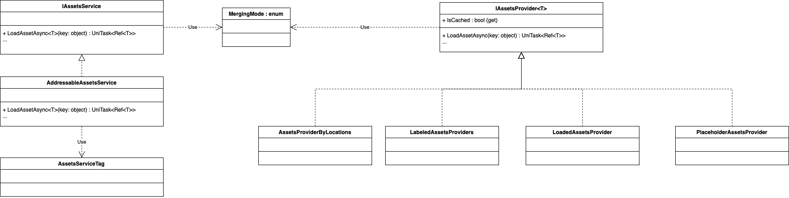

# Assets Services

This framework is based on the interfaces IAssetsService and IAssetsProvider<T>.
The idea is that any singleton in the GeniesContext that provides assets should be behind any of this two interfaces.

* The IAssetsService is full of generic methods and should be able to load any remote asset, in our case, it will be a layer of abstraction between our code an the Addressables API. 
The framework currently provides one implementation for the Addressables API, the AddressableAssetsService.

* The IAssetsProvider<T> is similar to the assets service, but it refers exclusively to a group of assets of the same type.
The interface provides some methods like loading all the assets from the group or caching them in memory. This interface should replace our old Addressables providers. 
The framework currently provides one implementation for the Addressables API, for grouping assets by a group of labels and merge mode, the LabeledAssetsProvider<T>.

## UML Diagram
### Preview

### Reference
Diagram io: https://drive.google.com/file/d/1AQJ056J5XVKGHSlLWhjOsKW8_7mlm72-/view?usp=share_link
