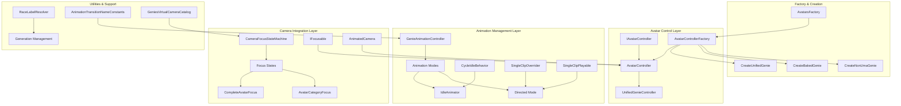

# Genies Avatars Behaviors Package Documentation

**Version:** 1.0.30  
**Unity Version:** 2022.3.32f1 or higher  
**Namespace:** `Genies.Avatars.Behaviors`

## Overview

The **Genies Avatars Behaviors** package provides high-level avatar control and behavior management systems within the Genies ecosystem. This package offers sophisticated avatar controller interfaces, animation management systems, camera focus controls, and factory methods for creating different types of avatar instances. It serves as the behavioral layer that orchestrates avatar interactions, animations, and lifecycle management.

## Package Structure

```
Genies.Avatars.Behaviors/
├── Runtime/
│   ├── Core Controllers/          # Avatar control interfaces and implementations
│   │   ├── IAvatarController.cs   # Avatar controller interface
│   │   ├── AvatarController.cs    # Main avatar controller implementation
│   │   └── AvatarControllerFactory.cs # Factory for avatar creation
│   ├── Animation/                 # Animation management system
│   │   ├── GenieAnimationController.cs    # Animation state management
│   │   ├── CycleIdleBehavior.cs          # Idle animation cycling
│   │   ├── SingleClipOverrider.cs        # Single animation override
│   │   ├── SingleClipPlayable.cs         # Playable animation control
│   │   ├── AnimationTransitionNameConstants.cs # Animation constants
│   │   └── CameraFocus/           # Camera-focused animation control
│   │       └── CameraFocusStateMachine.cs # State-based animation control
│   ├── Utils/                     # Utility classes
│   │   └── RaceLabelResolver.cs   # Avatar generation resolution
│   ├── GeniesVirtualCameraCatalog.cs # Virtual camera definitions
│   └── Resources/                 # Package resources
│       └── UnifiedGenieInstance.prefab   # Base avatar prefab
└── Documentation/
    └── Genies Behaviors.md       # This documentation
```

## Key Features

### 🎭 **Avatar Control System**
- Unified avatar controller interface for consistent avatar management
- Abstraction layer over UnifiedGenieController for simplified usage
- Lifecycle management with proper disposal and resource cleanup
- Integration with camera systems and interaction controls

### 🎬 **Advanced Animation Management**
- Multi-mode animation system (None, IdleAnimator, Directed)
- Automatic idle animation cycling with configurable timing
- Camera-aware animation state management
- Single clip override and playable systems

### 📹 **Camera-Focused Behaviors**
- Camera focus state machine for context-aware animations
- Different animation sets based on camera framing
- Integration with Genies camera system
- Focusable avatar components for camera targeting

### 🏭 **Avatar Factory System**
- Multiple avatar creation strategies (Unified, Baked, Non-UMA)
- Automated component setup and layer assignment
- Resource management and disposal integration
- Configurable avatar instantiation with proper hierarchy setup

## Architecture Overview



## Core Interfaces and Components

### Avatar Control System

#### `IAvatarController` Interface
The primary interface for avatar control and management:

```csharp
public interface IAvatarController
{
    // Core Properties
    GameObject GenieGameObject { get; }        // Avatar GameObject
    GameObject ParentGameObject { get; }       // Container GameObject
    UnifiedGenieController Controller { get; } // Underlying controller
    IFocusable Focusable { get; }             // Camera focusing capability
    
    // Animation and Camera
    Camera AnimatedCamera { get; set; }        // Avatar's animated camera
    Animator Animator { get; set; }            // Animation controller
    
    // Avatar Configuration
    UniTask SetDefinition(string definition);  // Apply avatar definition
    string GetDefinition();                    // Get current definition
    
    // Animation Control
    void SetDefaultAvatarAnimation();         // Reset to default animations
    
    // Interaction Management
    void ToggleInteraction(bool status);      // Enable/disable interactions
    
    // Lifecycle
    void Dispose();                           // Clean up resources
}
```

**Interface Features:**
- **Unified Access**: Single interface for all avatar operations
- **Camera Integration**: Built-in animated camera support
- **Definition Management**: JSON-based avatar configuration
- **Interaction Control**: Toggle avatar interaction capabilities
- **Resource Management**: Proper disposal and cleanup patterns

#### `AvatarController` Implementation
Main implementation providing comprehensive avatar management:

```csharp
public class AvatarController : MonoBehaviour, IAvatarController
{
    // Core Components
    public UnifiedGenieController Controller { get; private set; }
    public GenieAnimationController AnimationController { get; private set; }
    public Animator Animator { get; set; }
    public Camera AnimatedCamera { get; set; }
    public IFocusable Focusable { get; private set; }
    
    // Initialization and Setup
    public void Initialize(UnifiedGenieController controller);
    
    // Avatar Definition Management
    public async UniTask SetDefinition(string definition);
    public string GetDefinition();
    
    // Animation Control
    public void SetDefaultAvatarAnimation();
    
    // Resource Management
    public void Dispose();
}
```

**Implementation Features:**
- **Component Integration**: Seamless integration with Unity components
- **Animation Management**: Advanced animation control through GenieAnimationController
- **Performance Monitoring**: Built-in performance tracking
- **Focusable Support**: Camera system integration for targeting

### Avatar Factory System

#### `AvatarControllerFactory` Class
Static factory for creating different types of avatar instances:

```csharp
public static class AvatarControllerFactory
{
    // Unified Avatar Creation (Full UMA support)
    public static async UniTask<IAvatarController> CreateUnifiedGenie(
        string avatarDefinition, 
        Transform root
    );
    
    // Baked Avatar Creation (Performance optimized)
    public static async UniTask<IGenie> CreateBakedGenie(
        string avatarDefinition, 
        Transform root
    );
    
    // Non-UMA Avatar Creation (Lightweight)
    public static async UniTask<IAvatarController> CreateNonUmaGenie(
        string avatarDefinition, 
        Transform root
    );
}
```

**Factory Features:**
- **Multiple Creation Strategies**: Support for different avatar types based on needs
- **Automatic Setup**: Handles prefab instantiation, component setup, and layer assignment
- **Resource Management**: Proper disposal integration and cleanup procedures
- **Camera Integration**: Automatic camera hierarchy setup and parenting

## Animation Management System

### `GenieAnimationController` Component
Advanced animation management for avatars:

```csharp
public class GenieAnimationController : MonoBehaviour
{
    // Animation Modes
    public AvatarAnimationMode CurrentMode;    // Current animation mode
    public RuntimeAnimatorController UnifiedIdleAnimator; // Idle animator
    
    // Mode Management
    public void SetAnimationMode(AvatarAnimationMode mode);
    public void PlayDirectedAnimation(AnimationClip clip);
    public void SetIdleMode();
}

public enum AvatarAnimationMode
{
    None,           // No animation active
    IdleAnimator,   // Automatic idle animations
    Directed        // Manual animation control
}
```

**Animation Controller Features:**
- **Multi-Mode Support**: Switch between different animation strategies
- **Idle Management**: Automatic idle animation cycling
- **Directed Control**: Manual animation clip playback
- **Service Integration**: Built on Genies service management framework

### `CycleIdleBehavior` Component
StateMachineBehaviour for automatic idle animation cycling:

```csharp
public class CycleIdleBehavior : StateMachineBehaviour
{
    // Configuration
    public Vector2 BaseIdleMinMaxCycles = new Vector2(1f,3f); // Cycle timing
    public bool AllowRepeatIdles = false;                     // Prevent repetition
    
    // State Machine Events
    public override void OnStateEnter(Animator animator, AnimatorStateInfo stateInfo, int layerIndex);
    public override void OnStateUpdate(Animator animator, AnimatorStateInfo stateInfo, int layerIndex);
}
```

**Idle Behavior Features:**
- **Configurable Timing**: Min/max cycle durations for natural variation
- **Repeat Control**: Option to prevent consecutive identical idles
- **Random Selection**: Intelligent selection of next idle animation
- **State Tracking**: Maintains history for better animation flow

### Camera Focus Integration

#### `CameraFocusStateMachine` Class
Static state machine for camera-aware animation control:

```csharp
public static class CameraFocusStateMachine
{
    // Focus States
    public enum CameraFocusState
    {
        CompleteAvatarFocus,    // Full avatar visible
        AvatarCategoryFocus     // Focused on specific parts
    }
    
    // State Management
    public static void SetCameraFocusState(CameraFocusState state);
    public static bool CanPlayAnimationTransition(string transitionName);
    public static HashSet<string> GetAllowableAnimationTransitions();
}
```

**Camera Focus Features:**
- **Context-Aware Animations**: Different animation sets based on camera framing
- **Transition Management**: Control which animations are available per focus state
- **Performance Optimization**: Avoid unnecessary animations when not visible
- **Integration**: Works with Genies camera system and virtual cameras

## Usage Examples

### Basic Avatar Creation and Management

```csharp
public class AvatarManager : MonoBehaviour
{
    [SerializeField] private Transform avatarParent;
    [SerializeField] private string avatarDefinitionJson;
    
    private IAvatarController _avatarController;
    
    private async void Start()
    {
        await CreateAndSetupAvatar();
    }
    
    private async UniTask CreateAndSetupAvatar()
    {
        try
        {
            Debug.Log("Creating unified avatar...");
            
            // Create unified avatar with full UMA support
            _avatarController = await AvatarControllerFactory.CreateUnifiedGenie(
                avatarDefinitionJson,
                avatarParent
            );
            
            if (_avatarController != null)
            {
                Debug.Log("Avatar created successfully");
                ConfigureAvatar();
            }
        }
        catch (Exception ex)
        {
            Debug.LogError($"Failed to create avatar: {ex.Message}");
            await CreateFallbackAvatar();
        }
    }
    
    private async UniTask CreateFallbackAvatar()
    {
        try
        {
            Debug.Log("Creating fallback non-UMA avatar...");
            
            // Fallback to non-UMA avatar for better compatibility
            _avatarController = await AvatarControllerFactory.CreateNonUmaGenie(
                avatarDefinitionJson,
                avatarParent
            );
            
            if (_avatarController != null)
            {
                Debug.Log("Fallback avatar created successfully");
                ConfigureAvatar();
            }
        }
        catch (Exception ex)
        {
            Debug.LogError($"Failed to create fallback avatar: {ex.Message}");
        }
    }
    
    private void ConfigureAvatar()
    {
        // Set up default animations
        _avatarController.SetDefaultAvatarAnimation();
        
        // Enable avatar interactions
        _avatarController.ToggleInteraction(true);
        
        // Configure camera if needed
        if (_avatarController.AnimatedCamera != null)
        {
            _avatarController.AnimatedCamera.enabled = true;
        }
        
        // Set up performance monitoring
        SetupPerformanceMonitoring();
    }
    
    private void SetupPerformanceMonitoring()
    {
        // Example: Monitor avatar performance
        var animator = _avatarController.Animator;
        if (animator != null)
        {
            // Add performance monitoring as needed
            Debug.Log($"Avatar animator configured: {animator.name}");
        }
    }
    
    public async UniTask UpdateAvatarDefinition(string newDefinition)
    {
        if (_avatarController != null)
        {
            try
            {
                await _avatarController.SetDefinition(newDefinition);
                Debug.Log("Avatar definition updated successfully");
            }
            catch (Exception ex)
            {
                Debug.LogError($"Failed to update avatar definition: {ex.Message}");
            }
        }
    }
    
    public void EnableAvatarInteraction(bool enable)
    {
        _avatarController?.ToggleInteraction(enable);
        Debug.Log($"Avatar interaction {(enable ? "enabled" : "disabled")}");
    }
    
    private void OnDestroy()
    {
        // Clean up avatar resources
        _avatarController?.Dispose();
    }
}
```

### Advanced Animation Control

```csharp
public class AvatarAnimationManager : MonoBehaviour
{
    [SerializeField] private AvatarController avatarController;
    [SerializeField] private AnimationClip[] customAnimations;
    [SerializeField] private RuntimeAnimatorController idleController;
    
    private GenieAnimationController _animationController;
    
    private void Start()
    {
        if (avatarController != null)
        {
            _animationController = avatarController.AnimationController;
            SetupAnimationModes();
        }
    }
    
    private void SetupAnimationModes()
    {
        // Configure idle animator
        if (idleController != null)
        {
            _animationController.UnifiedIdleAnimator = idleController;
        }
        
        // Start in idle mode
        SetIdleMode();
    }
    
    public void SetIdleMode()
    {
        if (_animationController != null)
        {
            _animationController.SetAnimationMode(AvatarAnimationMode.IdleAnimator);
            Debug.Log("Avatar set to idle animation mode");
        }
    }
    
    public void SetDirectedMode()
    {
        if (_animationController != null)
        {
            _animationController.SetAnimationMode(AvatarAnimationMode.Directed);
            Debug.Log("Avatar set to directed animation mode");
        }
    }
    
    public void PlayCustomAnimation(int animationIndex)
    {
        if (_animationController != null && 
            customAnimations != null && 
            animationIndex >= 0 && 
            animationIndex < customAnimations.Length)
        {
            // Switch to directed mode first
            SetDirectedMode();
            
            // Play the specific animation
            var clip = customAnimations[animationIndex];
            _animationController.PlayDirectedAnimation(clip);
            
            Debug.Log($"Playing custom animation: {clip.name}");
        }
    }
    
    public void SetAnimationMode(AvatarAnimationMode mode)
    {
        if (_animationController != null)
        {
            _animationController.SetAnimationMode(mode);
            Debug.Log($"Animation mode changed to: {mode}");
        }
    }
    
    // Example: Cycle through different animation modes
    public void CycleAnimationModes()
    {
        if (_animationController == null) return;
        
        var currentMode = _animationController.CurrentMode;
        var nextMode = currentMode switch
        {
            AvatarAnimationMode.None => AvatarAnimationMode.IdleAnimator,
            AvatarAnimationMode.IdleAnimator => AvatarAnimationMode.Directed,
            AvatarAnimationMode.Directed => AvatarAnimationMode.None,
            _ => AvatarAnimationMode.IdleAnimator
        };
        
        SetAnimationMode(nextMode);
    }
}
```

### Camera Focus and Animation Integration

```csharp
public class CameraFocusAnimationController : MonoBehaviour
{
    [SerializeField] private Camera mainCamera;
    [SerializeField] private AvatarController avatarController;
    
    private CameraFocusStateMachine.CameraFocusState _currentFocusState;
    
    private void Start()
    {
        // Initialize with complete avatar focus
        SetCameraFocus(CameraFocusStateMachine.CameraFocusState.CompleteAvatarFocus);
    }
    
    public void SetCameraFocus(CameraFocusStateMachine.CameraFocusState focusState)
    {
        _currentFocusState = focusState;
        CameraFocusStateMachine.SetCameraFocusState(focusState);
        
        Debug.Log($"Camera focus changed to: {focusState}");
        
        // Update available animations based on focus
        UpdateAvailableAnimations();
    }
    
    private void UpdateAvailableAnimations()
    {
        var allowableTransitions = CameraFocusStateMachine.GetAllowableAnimationTransitions();
        Debug.Log($"Available animation transitions: {allowableTransitions.Count}");
        
        foreach (var transition in allowableTransitions)
        {
            Debug.Log($"  - {transition}");
        }
    }
    
    public void TryPlayAnimation(string transitionName)
    {
        bool canPlay = CameraFocusStateMachine.CanPlayAnimationTransition(transitionName);
        
        if (canPlay)
        {
            Debug.Log($"Playing animation transition: {transitionName}");
            
            // Trigger the animation transition
            if (avatarController?.Animator != null)
            {
                avatarController.Animator.SetTrigger(transitionName);
            }
        }
        else
        {
            Debug.LogWarning($"Animation transition not allowed in current focus state: {transitionName}");
        }
    }
    
    public void FocusOnCompleteAvatar()
    {
        SetCameraFocus(CameraFocusStateMachine.CameraFocusState.CompleteAvatarFocus);
        
        // Enable all idle animations
        TryPlayAnimation(AnimationTransitionNameConstants.UnifiedTransitionToIdle2);
    }
    
    public void FocusOnAvatarCategory()
    {
        SetCameraFocus(CameraFocusStateMachine.CameraFocusState.AvatarCategoryFocus);
        
        // Limit animations to category-appropriate ones
        Debug.Log("Focused on avatar category - limited animations available");
    }
    
    // Example: Smart animation selection based on focus
    public void PlayContextualIdleAnimation()
    {
        var availableTransitions = CameraFocusStateMachine.GetAllowableAnimationTransitions().ToArray();
        
        if (availableTransitions.Length > 0)
        {
            // Select a random available transition
            var randomTransition = availableTransitions[Random.Range(0, availableTransitions.Length)];
            TryPlayAnimation(randomTransition);
        }
        else
        {
            Debug.LogWarning("No idle animations available for current camera focus");
        }
    }
}
```

### Performance-Optimized Avatar Creation

```csharp
public class OptimizedAvatarManager : MonoBehaviour
{
    [System.Serializable]
    public class AvatarCreationSettings
    {
        public string avatarDefinition;
        public bool useBakedAvatar = false;
        public bool useNonUmaAvatar = false;
        public Transform targetParent;
    }
    
    [SerializeField] private AvatarCreationSettings[] avatarSettings;
    [SerializeField] private bool enablePerformanceMonitoring = true;
    
    private List<IAvatarController> _activeAvatars = new List<IAvatarController>();
    private List<IGenie> _bakedAvatars = new List<IGenie>();
    
    private async void Start()
    {
        await CreateAllAvatars();
    }
    
    private async UniTask CreateAllAvatars()
    {
        foreach (var settings in avatarSettings)
        {
            await CreateOptimalAvatar(settings);
            
            // Small delay to prevent overwhelming the system
            await UniTask.Delay(100);
        }
        
        Debug.Log($"Created {_activeAvatars.Count} avatar controllers and {_bakedAvatars.Count} baked avatars");
    }
    
    private async UniTask CreateOptimalAvatar(AvatarCreationSettings settings)
    {
        try
        {
            if (settings.useBakedAvatar)
            {
                // Create baked avatar for performance
                var bakedGenie = await AvatarControllerFactory.CreateBakedGenie(
                    settings.avatarDefinition,
                    settings.targetParent
                );
                
                if (bakedGenie != null)
                {
                    _bakedAvatars.Add(bakedGenie);
                    Debug.Log("Created baked avatar for optimal performance");
                }
            }
            else
            {
                IAvatarController avatarController;
                
                if (settings.useNonUmaAvatar)
                {
                    // Create non-UMA avatar for compatibility
                    avatarController = await AvatarControllerFactory.CreateNonUmaGenie(
                        settings.avatarDefinition,
                        settings.targetParent
                    );
                }
                else
                {
                    // Create full unified avatar
                    avatarController = await AvatarControllerFactory.CreateUnifiedGenie(
                        settings.avatarDefinition,
                        settings.targetParent
                    );
                }
                
                if (avatarController != null)
                {
                    _activeAvatars.Add(avatarController);
                    ConfigureAvatarController(avatarController);
                    
                    Debug.Log($"Created avatar controller: {avatarController.GenieGameObject.name}");
                }
            }
        }
        catch (Exception ex)
        {
            Debug.LogError($"Failed to create avatar: {ex.Message}");
        }
    }
    
    private void ConfigureAvatarController(IAvatarController controller)
    {
        // Set default animation
        controller.SetDefaultAvatarAnimation();
        
        // Configure interaction based on requirements
        controller.ToggleInteraction(true);
        
        // Set up camera if available
        if (controller.AnimatedCamera != null)
        {
            controller.AnimatedCamera.enabled = true;
        }
        
        // Performance monitoring
        if (enablePerformanceMonitoring)
        {
            SetupPerformanceTracking(controller);
        }
    }
    
    private void SetupPerformanceTracking(IAvatarController controller)
    {
        // Example performance tracking setup
        var animator = controller.Animator;
        if (animator != null)
        {
            Debug.Log($"Performance tracking enabled for avatar: {controller.GenieGameObject.name}");
            // Add performance monitoring components or callbacks as needed
        }
    }
    
    public void UpdateAllAvatarDefinitions(string newDefinition)
    {
        StartCoroutine(UpdateAvatarsCoroutine(newDefinition));
    }
    
    private System.Collections.IEnumerator UpdateAvatarsCoroutine(string newDefinition)
    {
        foreach (var controller in _activeAvatars)
        {
            if (controller != null)
            {
                var updateTask = controller.SetDefinition(newDefinition);
                yield return new WaitUntil(() => updateTask.Status != UniTaskStatus.Pending);
                
                if (updateTask.Status == UniTaskStatus.Succeeded)
                {
                    Debug.Log($"Updated avatar definition for: {controller.GenieGameObject.name}");
                }
                else
                {
                    Debug.LogError($"Failed to update avatar: {controller.GenieGameObject.name}");
                }
            }
        }
    }
    
    public void EnableAllAvatarInteractions(bool enable)
    {
        foreach (var controller in _activeAvatars)
        {
            controller?.ToggleInteraction(enable);
        }
        
        Debug.Log($"All avatar interactions {(enable ? "enabled" : "disabled")}");
    }
    
    private void OnDestroy()
    {
        // Clean up all avatar resources
        foreach (var controller in _activeAvatars)
        {
            controller?.Dispose();
        }
        
        foreach (var genie in _bakedAvatars)
        {
            genie?.Dispose();
        }
        
        _activeAvatars.Clear();
        _bakedAvatars.Clear();
    }
}
```

### Utility Integration and Generation Management

```csharp
public class AvatarGenerationManager : MonoBehaviour
{
    private void Start()
    {
        DisplayGenerationInfo();
    }
    
    private void DisplayGenerationInfo()
    {
        string currentGen = RaceLabelResolver.GetRaceLabel();
        string previousGen = RaceLabelResolver.GetPreviousRaceLabel();
        
        Debug.Log($"Current avatar generation: {currentGen}");
        Debug.Log($"Previous avatar generation: {previousGen}");
    }
    
    public bool IsCurrentGeneration(string avatarDefinition)
    {
        string currentGen = RaceLabelResolver.GetRaceLabel();
        
        // Check if avatar definition contains current generation identifier
        return avatarDefinition.Contains(currentGen);
    }
    
    public bool IsPreviousGeneration(string avatarDefinition)
    {
        string previousGen = RaceLabelResolver.GetPreviousRaceLabel();
        
        // Check if avatar definition contains previous generation identifier
        return avatarDefinition.Contains(previousGen);
    }
    
    public string MigrateAvatarDefinition(string oldDefinition)
    {
        string previousGen = RaceLabelResolver.GetPreviousRaceLabel();
        string currentGen = RaceLabelResolver.GetRaceLabel();
        
        if (IsPreviousGeneration(oldDefinition))
        {
            // Example migration logic
            string migratedDefinition = oldDefinition.Replace(previousGen, currentGen);
            Debug.Log($"Migrated avatar from {previousGen} to {currentGen}");
            return migratedDefinition;
        }
        
        return oldDefinition; // No migration needed
    }
}
```

## Configuration and Best Practices

### Avatar Creation Strategy Selection

```csharp
public static class AvatarCreationStrategy
{
    public enum AvatarType
    {
        UnifiedGenie,    // Full features, highest resource usage
        BakedGenie,      // Performance optimized, static
        NonUmaGenie      // Lightweight, compatible
    }
    
    public static AvatarType RecommendAvatarType(bool isPerformanceCritical, bool needsRuntimeModification)
    {
        if (isPerformanceCritical && !needsRuntimeModification)
        {
            return AvatarType.BakedGenie;
        }
        else if (needsRuntimeModification)
        {
            return AvatarType.UnifiedGenie;
        }
        else
        {
            return AvatarType.NonUmaGenie;
        }
    }
}
```

### Performance Configuration

```csharp
public class AvatarPerformanceSettings : ScriptableObject
{
    [Header("Animation Settings")]
    public bool enableIdleCycling = true;
    public Vector2 idleCycleRange = new Vector2(1f, 3f);
    public bool allowRepeatIdles = false;
    
    [Header("Camera Settings")]
    public bool enableCameraFocusOptimization = true;
    public CameraFocusStateMachine.CameraFocusState defaultFocusState = 
        CameraFocusStateMachine.CameraFocusState.CompleteAvatarFocus;
    
    [Header("Performance Monitoring")]
    public bool enablePerformanceTracking = true;
    public int maxSimultaneousAvatars = 10;
}
```

## Dependencies and Integration

### Core Dependencies
- **com.genies.avatars** (2.0.8): Core avatar system and components
- **com.genies.camerasystem** (1.0.16): Camera system integration and focus management
- **com.genies.performancemonitoring** (1.0.1): Performance tracking and optimization
- **com.genies.thirdparty.unitask** (1.1.0): Asynchronous operations support
- **com.genies.servicemanagement** (1.1.1): Service management framework
- **com.genies.utilities** (1.6.0): Utility functions and extensions
- **com.genies.uiframework** (1.6.0): UI integration and framework support

### Integration with Other Genies Packages

```csharp
public class FullBehaviorIntegration : MonoBehaviour
{
    private IAvatarController _avatarController;
    
    private async void Start()
    {
        await InitializeIntegratedAvatar();
    }
    
    private async UniTask InitializeIntegratedAvatar()
    {
        try
        {
            // Create avatar through behaviors factory
            _avatarController = await AvatarControllerFactory.CreateUnifiedGenie(
                avatarDefinition: GetAvatarDefinition(),
                root: transform
            );
            
            // Integrate with camera system
            IntegrateWithCameraSystem();
            
            // Setup animation behaviors
            SetupAnimationBehaviors();
            
            // Enable performance monitoring
            EnablePerformanceMonitoring();
            
            Debug.Log("Full behavior integration complete");
        }
        catch (Exception ex)
        {
            Debug.LogError($"Integration failed: {ex.Message}");
        }
    }
    
    private string GetAvatarDefinition()
    {
        // Get avatar definition from various sources
        // This could come from login service, closet service, etc.
        return "{}"; // Placeholder
    }
    
    private void IntegrateWithCameraSystem()
    {
        if (_avatarController.Focusable != null)
        {
            // Register with camera system for focus targeting
            Debug.Log("Avatar registered for camera focusing");
        }
    }
    
    private void SetupAnimationBehaviors()
    {
        // Configure idle cycling
        CameraFocusStateMachine.SetCameraFocusState(
            CameraFocusStateMachine.CameraFocusState.CompleteAvatarFocus
        );
        
        // Set default animations
        _avatarController.SetDefaultAvatarAnimation();
    }
    
    private void EnablePerformanceMonitoring()
    {
        // Performance monitoring integration
        Debug.Log("Performance monitoring enabled for avatar behaviors");
    }
}
```

## Best Practices

### Avatar Lifecycle Management
- **Proper Disposal**: Always call Dispose() on avatar controllers when finished
- **Resource Monitoring**: Monitor memory usage especially with multiple avatars
- **Factory Pattern**: Use AvatarControllerFactory for consistent avatar creation
- **Error Handling**: Implement comprehensive error handling with fallback strategies

### Animation Performance
- **Mode Selection**: Choose appropriate animation modes based on use case
- **Idle Optimization**: Configure idle cycling parameters for natural behavior
- **Camera Awareness**: Use camera focus states to optimize animation performance
- **Transition Management**: Leverage animation transition constants for consistency

### Development Workflow
- **Generation Management**: Use RaceLabelResolver for avatar generation compatibility
- **Performance Testing**: Test with multiple avatars to identify bottlenecks
- **Service Integration**: Leverage service management for proper component lifecycle
- **Configuration**: Use ScriptableObjects for configurable behavior settings

## Conclusion

The **Genies Avatars Behaviors** package provides a sophisticated behavioral layer for avatar management within the Genies ecosystem. Its combination of high-level controller interfaces, advanced animation management, camera-aware behaviors, and flexible factory systems enables developers to create rich, interactive avatar experiences.

The package's integration with performance monitoring, camera systems, and service management frameworks ensures that avatars can be efficiently managed at scale while maintaining high-quality behavioral interactions. The multiple avatar creation strategies allow developers to optimize for their specific use cases, whether prioritizing performance, features, or compatibility.

For additional support, advanced integration scenarios, or questions about avatar behavior systems, please refer to the package changelog or contact the Genies engineering team.
