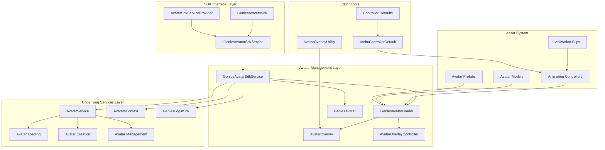

# Genies Avatars SDK Package Documentation

**Version:** 2.0.1  
**Unity Version:** 2022.3.32f1 or higher  
**Namespace:** `Genies.Avatars.Sdk`

## Overview

The **Genies Avatars SDK** serves as the central package for accessing avatar functionality within the Genies ecosystem. This high-level SDK provides a unified interface for loading, managing, and customizing avatars, building upon the foundational avatar services and components. It offers simplified APIs for common avatar operations while maintaining the flexibility and power of the underlying avatar system.

## Package Structure

```
Genies.Avatars.Sdk/
├── Runtime/
│   ├── Scripts/                   # Core SDK components
│   │   ├── IGeniesAvatarSdkService.cs    # Main service interface
│   │   ├── GeniesAvatarSdkService.cs     # Service implementation
│   │   ├── GeniesAvatar.cs              # Avatar wrapper class
│   │   ├── GeniesAvatarLoader.cs        # MonoBehaviour avatar loader
│   │   ├── AvatarOverlay.cs             # Avatar overlay component
│   │   ├── AvatarOverlayController.cs   # Overlay management
│   │   ├── AvatarSdkServiceProvider.cs  # Service provider utility
│   │   ├── CreateUserAvatar.cs          # User avatar creation utility
│   │   └── GeniesAvatarsSdk.cs          # Static SDK interface
│   ├── Animation/                 # Animation assets and controllers
│   │   ├── Clips/                # Animation clips (Idle, Walk, Run, Jump, etc.)
│   │   ├── FaceParameters.controller    # Facial animation controller
│   │   ├── GrabAnimationController.controller  # Hand/grab animations
│   │   └── IdleJumpRunWalk.controller   # Basic movement animations
│   ├── Models/                    # 3D avatar models
│   │   └── Avatar.fbx            # Base avatar model
│   └── Prefabs/                   # Avatar prefabs
│       └── CreateUserAvatar.prefab      # User avatar creation prefab
├── Editor/                        # Editor tools and utilities
│   ├── IAnimControllerDefault.cs        # Animation controller defaults interface
│   ├── AnimControllerDefaultsConfig.cs  # Configuration for defaults
│   ├── AvatarOverlayUtility.cs         # Overlay creation utilities
│   ├── AvatarAnimatorControllerUtility.cs # Controller utilities
│   ├── FaceParamAnimControllerDefaultAsset.cs  # Face parameter defaults
│   └── GrabLayersAnimControllerDefaultAsset.cs # Grab layer defaults
└── Documentation/
    └── Genies Avatars.md          # This documentation
```

## Key Features

### 🎭 **High-Level Avatar Management**
- Unified SDK interface for avatar operations
- Simplified avatar loading from user accounts
- Default avatar creation with standard configurations
- Integration with authentication and user services

### 🔧 **Avatar Customization System**
- Avatar overlay system for additional geometry and effects
- Runtime animation controller switching
- Texture atlas resolution control
- Species and LOD (Level of Detail) management

### 🎬 **Animation Integration**
- Pre-configured animation controllers for common scenarios
- Face parameter animation support
- Grab/hand animation system
- Basic movement animations (idle, walk, run, jump)

### 🛠️ **Editor Tools**
- Avatar overlay creation utilities
- Animation controller default configuration system
- Prefab creation tools with automatic component setup
- Integration with Unity's animation and prefab workflows

## Architecture Overview



## Core Services and Components

### Avatar SDK Service

#### `IGeniesAvatarSdkService` Interface
The primary interface for avatar SDK operations with comprehensive XML documentation:

```csharp
/// <summary>
/// Core service interface for loading and managing Genies avatars in runtime environments.
/// Provides methods for creating avatar instances with customizable properties and animation controllers.
/// </summary>
public interface IGeniesAvatarSdkService
{
    /// <summary>
    /// Loads the currently logged-in user's avatar as a runtime instance.
    /// </summary>
    UniTask<IGenie> LoadUserRuntimeAvatarAsync(
        string avatarName = null,
        Transform parent = null,
        RuntimeAnimatorController playerAnimationController = null,
        int atlasResolution = 512,
        bool waitUntilUserIsLoggedIn = false
    );
    
    /// <summary>
    /// Retrieves avatar data for a specific user by their user ID.
    /// </summary>
    UniTask<List<Genies.Services.Model.Avatar>> LoadAvatarsDataByUserIdAsync(string userId);
    
    /// <summary>
    /// Loads a default avatar configuration as a runtime instance.
    /// This provides a fallback avatar when user-specific avatars are unavailable.
    /// </summary>
    UniTask<IGenie> LoadDefaultRuntimeAvatarAsync(
        string avatarName = null,
        Transform parent = null,
        RuntimeAnimatorController playerAnimationController = null,
        int atlasResolution = 512
    );
    
    /// <summary>
    /// Loads an avatar from a JSON definition string as a runtime instance.
    /// </summary>
    UniTask<IGenie> LoadRuntimeAvatarAsync(
        string definition,
        string avatarName = null,
        Transform parent = null,
        RuntimeAnimatorController playerAnimationController = null,
        int atlasResolution = 512
    );
    
    /// <summary>
    /// Loads an avatar from an AvatarDefinition object as a runtime instance.
    /// </summary>
    UniTask<IGenie> LoadRuntimeAvatarAsync(
        Naf.AvatarDefinition definition,
        string avatarName = null,
        Transform parent = null,
        RuntimeAnimatorController playerAnimationController = null,
        int atlasResolution = 512
    );
    
    /// <summary>
    /// Retrieves the avatar definition for the currently logged-in user as a JSON string.
    /// </summary>
    UniTask<string> GetMyAvatarDefinition(bool waitUntilUserIsLoggedIn = false);
    
    /// <summary>
    /// Loads the avatar definition string for a specific user by their user ID.
    /// </summary>
    UniTask<string> LoadAvatarDefStringByUserId(string userId);
}
```

**Service Features:**
- **User Authentication Integration**: Automatically handles login state and user data
- **Flexible Loading**: Support for user avatars, default avatars, and custom data
- **Configuration Options**: Customizable names, parents, animations, and texture quality
- **Async Operations**: Non-blocking operations using UniTask

#### `GeniesAvatarSdkService` Implementation
Default implementation providing comprehensive avatar management:

```csharp
public class GeniesAvatarSdkService : IGeniesAvatarSdkService
{
    // Core service implementation with AvatarService integration
    public async UniTask<IEditableGenie> LoadUserRuntimeAvatarAsync(...);
    public async UniTask<List<Avatar>> LoadAvatarsDataByUserIdAsync(string userId);
    public async UniTask<IEditableGenie> LoadDefaultRuntimeAvatarAsync(...);
    public async UniTask<IEditableGenie> LoadAvatarFromDataAsync(...);
}
```

**Implementation Features:**
- **Service Integration**: Built on top of AvatarService and AvatarsContext
- **Error Handling**: Comprehensive error handling with fallback to default avatars
- **Resource Management**: Proper cleanup and disposal of avatar resources
- **Context Management**: Automatic avatar context initialization

### Avatar Components

#### `GeniesAvatar` Class
High-level wrapper for avatar instances with comprehensive customization features:

```csharp
/// <summary>
/// Thin wrapper over NativeUnifiedGenieController that also surfaces the high-level IGenie handles.
/// Provides a unified interface for avatar manipulation including equipment, colors, body attributes, and tattoos.
/// </summary>
public class GeniesAvatar
{
    // Avatar Properties
    public string Species { get; }        // Avatar species identifier
    public string Lod { get; }           // Level of detail identifier
    public GameObject Root { get; }       // Root GameObject
    public GameObject ModelRoot { get; }  // 3D model GameObject
    public Transform SkeletonRoot { get; } // Skeleton root transform
    public Animator Animator { get; }     // Animation controller
    
    // Animation Control
    /// <summary>
    /// Sets the runtime animator controller for this avatar's Animator component.
    /// This allows customization of the avatar's animation behaviors and state machine.
    /// </summary>
    public void SetAnimatorController(RuntimeAnimatorController playerAnimationController);
    
    // Asset Management
    /// <summary>
    /// Equips a specific asset (clothing, accessory, etc.) to the avatar asynchronously.
    /// </summary>
    public UniTask EquipAssetAsync(string assetId, Dictionary<string, string> parameters = null);
    
    /// <summary>
    /// Removes a specific asset from the avatar asynchronously.
    /// </summary>
    public UniTask UnequipAssetAsync(string assetId);
    
    /// <summary>
    /// Equips multiple assets to the avatar in a single batch operation asynchronously.
    /// </summary>
    public UniTask EquipAssetsAsync(IEnumerable<(string assetId, Dictionary<string, string> parameters)> assets);
    
    /// <summary>
    /// Removes multiple assets from the avatar in a single batch operation asynchronously.
    /// </summary>
    public UniTask UnequipAssetsAsync(IEnumerable<string> assetIds);
    
    /// <summary>
    /// Sets the complete set of equipped assets for the avatar, replacing any currently equipped assets.
    /// </summary>
    public UniTask SetEquippedAssetsAsync(IEnumerable<(string assetId, Dictionary<string, string> parameters)> assets);
    
    /// <summary>
    /// Checks whether a specific asset is currently equipped on the avatar.
    /// </summary>
    public bool IsAssetEquipped(string assetId);
    
    /// <summary>
    /// Gets a list containing the IDs of all currently equipped assets on the avatar.
    /// </summary>
    public List<string> GetEquippedAssetIds();
    
    // Color Customization
    /// <summary>
    /// Sets a specific color property on the avatar asynchronously (e.g., hair color, skin tone, clothing color).
    /// </summary>
    public UniTask SetColorAsync(string colorId, Color color);
    
    /// <summary>
    /// Sets multiple color properties on the avatar in a single batch operation asynchronously.
    /// </summary>
    public UniTask SetColorsAsync(IEnumerable<GenieColorEntry> colors);
    
    /// <summary>
    /// Gets the current color value for a specific color property on the avatar.
    /// </summary>
    public Color? GetColor(string colorId);
    
    /// <summary>
    /// Removes/resets a specific color property on the avatar asynchronously, reverting it to its default state.
    /// </summary>
    public UniTask UnsetColorAsync(string colorId);
    
    /// <summary>
    /// Removes/resets all color customizations on the avatar asynchronously, reverting all colors to their default states.
    /// </summary>
    public UniTask UnsetAllColorsAsync();
    
    /// <summary>
    /// Checks whether a specific color property is available for customization on this avatar.
    /// </summary>
    public bool IsColorAvailable(string colorId);
    
    // Body Attributes
    /// <summary>
    /// Sets a specific body attribute (e.g., muscle mass, height, body proportions) with a given weight value.
    /// </summary>
    public void SetBodyAttribute(string attributeId, float weight);
    
    /// <summary>
    /// Gets the current weight value for a specific body attribute on the avatar.
    /// </summary>
    public float GetBodyAttribute(string attributeId);
    
    /// <summary>
    /// Applies a predefined body attributes preset to the avatar, which sets multiple body attributes to specific values.
    /// </summary>
    public void SetBodyPreset(BodyAttributesPreset preset);
    
    /// <summary>
    /// Resets all body attributes on the avatar to their default values.
    /// </summary>
    public void ResetAllBodyAttributes();
    
    /// <summary>
    /// Checks whether a specific body attribute is available for customization on this avatar.
    /// </summary>
    public bool IsBodyAttributeAvailable(string attributeId);
    
    // Tattoo Management
    /// <summary>
    /// Equips a tattoo asset to a specific slot on the avatar's skin asynchronously.
    /// </summary>
    public UniTask EquipTattooAsync(MegaSkinTattooSlot slot, string assetId, Dictionary<string, string> parameters = null);
    
    /// <summary>
    /// Removes a tattoo from a specific slot on the avatar's skin asynchronously.
    /// </summary>
    public UniTask UnequipTattooAsync(MegaSkinTattooSlot slot);
    
    /// <summary>
    /// Removes all tattoos from the avatar asynchronously.
    /// </summary>
    public UniTask UnequipAllTattoosAsync();
    
    /// <summary>
    /// Checks whether a specific tattoo asset is currently equipped in a specific slot on the avatar.
    /// </summary>
    public bool IsTattooEquipped(MegaSkinTattooSlot slot, string assetId);
    
    /// <summary>
    /// Gets the asset ID of the tattoo currently equipped in a specific slot on the avatar.
    /// </summary>
    public string GetEquippedTattoo(MegaSkinTattooSlot slot);
    
    // Definition Import/Export
    /// <summary>
    /// Exports the current avatar configuration as a JSON definition string.
    /// This definition includes all equipped assets, colors, body attributes, and tattoos.
    /// </summary>
    public string GetDefinition();
    
    /// <summary>
    /// Applies a complete avatar configuration from a JSON definition string asynchronously.
    /// This will update all aspects of the avatar including assets, colors, body attributes, and tattoos.
    /// </summary>
    public UniTask SetDefinitionAsync(string definition);
    
    // Lifecycle Management
    /// <summary>
    /// Disposes native resources via controller and (optionally) caller should also destroy the GameObject hosting this avatar if needed.
    /// </summary>
    public void Dispose();
}
```

**GeniesAvatar Features:**
- **Comprehensive Customization**: Full support for assets, colors, body attributes, and tattoos
- **Batch Operations**: Efficient batch processing for multiple asset and color operations
- **Async Operations**: Non-blocking operations using UniTask for smooth user experience
- **Definition Management**: Complete avatar import/export via JSON definitions
- **Resource Management**: Proper disposal and cleanup of avatar resources
- **Validation**: Built-in availability checking for customization options

#### `GeniesAvatarLoader` Component
MonoBehaviour for loading and managing avatars in scenes:

```csharp
public sealed class GeniesAvatarLoader : MonoBehaviour
{
    // Configuration Properties
    public IGenie Genie { get; }          // Underlying avatar instance
    
    // Animation Control
    public void SetAnimatorController(RuntimeAnimatorController controller);
    
    // Overlay Management
    public void AddOverlay(AvatarOverlay overlay);
    public void RemoveOverlay(AvatarOverlay overlay);
    public void ClearOverlays();
    
    // Avatar Loading
    public async UniTask LoadUserAvatar(bool waitForLogin = false);
    public async UniTask LoadDefaultAvatar();
}
```

**AvatarLoader Features:**
- **Scene Integration**: Unity MonoBehaviour for easy scene placement
- **Overlay System**: Support for avatar overlays and attachments
- **Animation Management**: Runtime animation controller configuration
- **Async Loading**: Non-blocking avatar loading operations

### Avatar Overlay System

#### `AvatarOverlay` Component
Component for adding additional geometry or effects to avatars:

```csharp
public sealed class AvatarOverlay : MonoBehaviour
{
    // Internal root detection for overlay attachment
    internal bool TryGetRoot(out Transform root);
}
```

**Overlay Features:**
- **Attachment System**: Attach additional geometry to avatar bones
- **Runtime Support**: Dynamic overlay addition and removal
- **Hierarchical Structure**: Organized overlay structure with root detection
- **Effect Integration**: Support for visual effects and additional components

#### `AvatarOverlayController` Class
Manages multiple overlays on an avatar:

```csharp
public class AvatarOverlayController
{
    // Overlay management methods for controlling multiple overlays
    public void AddOverlay(AvatarOverlay overlay);
    public void RemoveOverlay(AvatarOverlay overlay);
    public void ClearAll();
}
```

**Overlay Controller Features:**
- **Multi-Overlay Support**: Manage multiple overlays simultaneously
- **Dynamic Control**: Runtime overlay addition, removal, and management
- **Cleanup**: Proper overlay disposal and resource management
- **Organization**: Centralized overlay management for complex avatars

## Static SDK Interface

### `GeniesAvatarsSdk` Class
Static interface for accessing SDK functionality:

```csharp
public static class GeniesAvatarsSdk
{
    // Service Access
    public static IGeniesAvatarSdkService Service { get; }
    
    // Quick Access Methods
    public static UniTask<IEditableGenie> LoadUserAvatar(
        string avatarName = null,
        Transform parent = null,
        RuntimeAnimatorController animatorController = null,
        int atlasResolution = 512,
        bool waitUntilUserIsLoggedIn = false
    );
    
    public static UniTask<IEditableGenie> LoadDefaultAvatar(
        string avatarName = null,
        Transform parent = null,
        RuntimeAnimatorController animatorController = null,
        int atlasResolution = 512
    );
}
```

**Static SDK Features:**
- **Global Access**: Easy access to SDK functionality from anywhere
- **Convenience Methods**: Simplified methods for common operations
- **Service Management**: Centralized service instance management
- **Quick Integration**: Fast integration with existing codebases

## Usage Examples

### Basic Avatar Loading

```csharp
public class AvatarManager : MonoBehaviour
{
    [SerializeField] private Transform avatarParent;
    [SerializeField] private RuntimeAnimatorController movementController;
    
    private IEditableGenie _currentAvatar;
    
    private async void Start()
    {
        await LoadUserAvatar();
    }
    
    public async UniTask LoadUserAvatar()
    {
        try
        {
            Debug.Log("Loading user avatar...");
            
            // Load user's avatar with custom settings
            _currentAvatar = await GeniesAvatarsSdk.LoadUserAvatar(
                avatarName: "Player Avatar",
                parent: avatarParent,
                animatorController: movementController,
                atlasResolution: 1024,
                waitUntilUserIsLoggedIn: true
            );
            
            if (_currentAvatar != null)
            {
                Debug.Log($"Successfully loaded avatar: {_currentAvatar.Root.name}");
                ConfigureAvatar(_currentAvatar);
            }
        }
        catch (Exception ex)
        {
            Debug.LogError($"Failed to load user avatar: {ex.Message}");
            await LoadFallbackAvatar();
        }
    }
    
    private async UniTask LoadFallbackAvatar()
    {
        try
        {
            Debug.Log("Loading default avatar as fallback...");
            
            _currentAvatar = await GeniesAvatarsSdk.LoadDefaultAvatar(
                avatarName: "Default Avatar",
                parent: avatarParent,
                animatorController: movementController,
                atlasResolution: 512
            );
            
            if (_currentAvatar != null)
            {
                Debug.Log("Successfully loaded default avatar");
                ConfigureAvatar(_currentAvatar);
            }
        }
        catch (Exception ex)
        {
            Debug.LogError($"Failed to load default avatar: {ex.Message}");
        }
    }
    
    private void ConfigureAvatar(IEditableGenie avatar)
    {
        // Configure avatar settings
        if (avatar.Animator != null)
        {
            avatar.Animator.applyRootMotion = true;
        }
        
        // Add any additional configuration
        SetupAvatarComponents(avatar);
    }
    
    private void SetupAvatarComponents(IEditableGenie avatar)
    {
        // Add additional components or configurations as needed
        var avatarRoot = avatar.Root;
        
        // Example: Add a character controller
        if (avatarRoot.GetComponent<CharacterController>() == null)
        {
            var characterController = avatarRoot.AddComponent<CharacterController>();
            characterController.height = 2f;
            characterController.radius = 0.5f;
        }
    }
}
```

### Using GeniesAvatarLoader Component

```csharp
public class SceneAvatarSetup : MonoBehaviour
{
    [SerializeField] private GeniesAvatarLoader avatarLoader;
    [SerializeField] private List<AvatarOverlay> overlays;
    [SerializeField] private RuntimeAnimatorController customAnimator;
    
    private async void Start()
    {
        await SetupAvatar();
    }
    
    private async UniTask SetupAvatar()
    {
        try
        {
            // Configure animation controller
            if (customAnimator != null)
            {
                avatarLoader.SetAnimatorController(customAnimator);
            }
            
            // Add overlays
            foreach (var overlay in overlays)
            {
                if (overlay != null)
                {
                    avatarLoader.AddOverlay(overlay);
                }
            }
            
            // Load user avatar (with fallback to default)
            await avatarLoader.LoadUserAvatar(waitForLogin: true);
            
            if (avatarLoader.Genie != null)
            {
                Debug.Log("Avatar loaded successfully through GeniesAvatarLoader");
                OnAvatarLoaded(avatarLoader.Genie);
            }
        }
        catch (Exception ex)
        {
            Debug.LogError($"Failed to setup avatar: {ex.Message}");
        }
    }
    
    private void OnAvatarLoaded(IGenie genie)
    {
        // Avatar loaded successfully
        ConfigureLoadedAvatar(genie);
    }
    
    private void ConfigureLoadedAvatar(IGenie genie)
    {
        // Configure the loaded avatar
        if (genie.Animator != null)
        {
            // Example: Set animation parameters
            genie.Animator.SetBool("IsGrounded", true);
        }
        
        // Example: Access skeleton bones
        var leftHand = genie.SkeletonRoot.GetBoneTransform(HumanBodyBones.LeftHand);
        if (leftHand != null)
        {
            // Attach something to the left hand
            AttachItemToHand(leftHand);
        }
    }
    
    private void AttachItemToHand(Transform handBone)
    {
        // Example: Attach an item to the hand
        var item = GameObject.CreatePrimitive(PrimitiveType.Cube);
        item.transform.SetParent(handBone);
        item.transform.localPosition = Vector3.zero;
        item.transform.localScale = Vector3.one * 0.1f;
    }
    
    public void AddOverlayAtRuntime(AvatarOverlay newOverlay)
    {
        if (avatarLoader != null && newOverlay != null)
        {
            avatarLoader.AddOverlay(newOverlay);
            Debug.Log($"Added overlay: {newOverlay.name}");
        }
    }
    
    public void RemoveOverlay(AvatarOverlay overlayToRemove)
    {
        if (avatarLoader != null && overlayToRemove != null)
        {
            avatarLoader.RemoveOverlay(overlayToRemove);
            Debug.Log($"Removed overlay: {overlayToRemove.name}");
        }
    }
}
```

### Avatar Service Integration

```csharp
public class CustomAvatarService : MonoBehaviour
{
    private IGeniesAvatarSdkService _avatarService;
    
    private void Start()
    {
        // Get service instance
        _avatarService = GeniesAvatarsSdk.Service;
        InitializeService();
    }
    
    private async void InitializeService()
    {
        try
        {
            // Initialize the service if needed (usually automatic)
            await ((GeniesAvatarSdkService)_avatarService).Initialize();
            Debug.Log("Avatar service initialized");
        }
        catch (Exception ex)
        {
            Debug.LogError($"Failed to initialize avatar service: {ex.Message}");
        }
    }
    
    public async UniTask LoadSpecificUserAvatar(string userId)
    {
        try
        {
            // Load avatar data for specific user
            var avatarDataList = await _avatarService.LoadAvatarsDataByUserIdAsync(userId);
            
            if (avatarDataList != null && avatarDataList.Count > 0)
            {
                var primaryAvatar = avatarDataList[0]; // Use first avatar
                
                Debug.Log($"Found {avatarDataList.Count} avatars for user {userId}");
                Debug.Log($"Loading primary avatar: {primaryAvatar.Id}");
                
                // Load avatar from data
                var loadedAvatar = await _avatarService.LoadAvatarFromDataAsync(
                    avatarData: primaryAvatar,
                    avatarName: $"Avatar_{userId}",
                    parent: transform,
                    atlasResolution: 1024
                );
                
                if (loadedAvatar != null)
                {
                    Debug.Log($"Successfully loaded avatar for user {userId}");
                    ConfigureLoadedAvatar(loadedAvatar);
                }
            }
            else
            {
                Debug.LogWarning($"No avatar data found for user {userId}");
            }
        }
        catch (Exception ex)
        {
            Debug.LogError($"Failed to load avatar for user {userId}: {ex.Message}");
        }
    }
    
    private void ConfigureLoadedAvatar(IEditableGenie avatar)
    {
        // Configure the loaded avatar
        Debug.Log($"Avatar Species: {avatar.Species}");
        Debug.Log($"Avatar LOD: {avatar.Lod}");
        
        // Access avatar components
        if (avatar.Animator != null)
        {
            Debug.Log($"Avatar has animator: {avatar.Animator.name}");
        }
        
        if (avatar.SkeletonRoot != null)
        {
            Debug.Log($"Skeleton root: {avatar.SkeletonRoot.name}");
        }
    }
    
    public async UniTask CreateAvatarWithCustomSettings(
        Transform parentTransform,
        RuntimeAnimatorController customController,
        int textureQuality = 1024)
    {
        try
        {
            var avatar = await _avatarService.LoadUserRuntimeAvatarAsync(
                avatarName: "Custom Avatar",
                parent: parentTransform,
                playerAnimationController: customController,
                atlasResolution: textureQuality,
                waitUntilUserIsLoggedIn: true
            );
            
            if (avatar != null)
            {
                Debug.Log("Created avatar with custom settings");
                
                // Wrap in GeniesAvatar for easier manipulation
                var geniesAvatar = new GeniesAvatar(avatar);
                
                // Use wrapper methods
                var headBone = geniesAvatar.GetBoneTransform(HumanBodyBones.Head);
                if (headBone != null)
                {
                    Debug.Log($"Head bone found at: {headBone.position}");
                }
            }
        }
        catch (Exception ex)
        {
            Debug.LogError($"Failed to create avatar with custom settings: {ex.Message}");
        }
    }
}
```

### Working with Avatar Overlays

```csharp
public class AvatarOverlayManager : MonoBehaviour
{
    [SerializeField] private GeniesAvatarLoader avatarLoader;
    [SerializeField] private List<GameObject> overlayPrefabs;
    
    private List<AvatarOverlay> _activeOverlays = new List<AvatarOverlay>();
    
    public async UniTask SetupAvatarWithOverlays()
    {
        try
        {
            // Load avatar first
            await avatarLoader.LoadUserAvatar(waitForLogin: false);
            
            if (avatarLoader.Genie != null)
            {
                // Create and add overlays
                await CreateOverlays();
                Debug.Log($"Avatar setup complete with {_activeOverlays.Count} overlays");
            }
        }
        catch (Exception ex)
        {
            Debug.LogError($"Failed to setup avatar with overlays: {ex.Message}");
        }
    }
    
    private async UniTask CreateOverlays()
    {
        foreach (var overlayPrefab in overlayPrefabs)
        {
            if (overlayPrefab != null)
            {
                await CreateAndAddOverlay(overlayPrefab);
            }
        }
    }
    
    private async UniTask CreateAndAddOverlay(GameObject overlayPrefab)
    {
        try
        {
            // Instantiate overlay
            var overlayInstance = Instantiate(overlayPrefab);
            
            // Get or add AvatarOverlay component
            var avatarOverlay = overlayInstance.GetComponent<AvatarOverlay>();
            if (avatarOverlay == null)
            {
                avatarOverlay = overlayInstance.AddComponent<AvatarOverlay>();
            }
            
            // Add to avatar
            avatarLoader.AddOverlay(avatarOverlay);
            _activeOverlays.Add(avatarOverlay);
            
            Debug.Log($"Added overlay: {overlayInstance.name}");
            
            // Small delay for processing
            await UniTask.Delay(100);
        }
        catch (Exception ex)
        {
            Debug.LogError($"Failed to create overlay from prefab {overlayPrefab.name}: {ex.Message}");
        }
    }
    
    public void RemoveAllOverlays()
    {
        foreach (var overlay in _activeOverlays)
        {
            if (overlay != null)
            {
                avatarLoader.RemoveOverlay(overlay);
                if (overlay.gameObject != null)
                {
                    DestroyImmediate(overlay.gameObject);
                }
            }
        }
        
        _activeOverlays.Clear();
        avatarLoader.ClearOverlays();
        Debug.Log("Removed all overlays");
    }
    
    public void AddOverlayByIndex(int index)
    {
        if (index >= 0 && index < overlayPrefabs.Count && overlayPrefabs[index] != null)
        {
            CreateAndAddOverlay(overlayPrefabs[index]).Forget();
        }
    }
    
    public void RemoveOverlayByIndex(int index)
    {
        if (index >= 0 && index < _activeOverlays.Count && _activeOverlays[index] != null)
        {
            var overlay = _activeOverlays[index];
            avatarLoader.RemoveOverlay(overlay);
            
            if (overlay.gameObject != null)
            {
                DestroyImmediate(overlay.gameObject);
            }
            
            _activeOverlays.RemoveAt(index);
            Debug.Log($"Removed overlay at index {index}");
        }
    }
}
```

## Editor Tools and Utilities

### Animation Controller Defaults

The SDK includes a system for applying default configurations to animation controllers:

```csharp
// Example usage of animation controller defaults
public class CustomAnimControllerDefault : AnimControllerDefaultAsset
{
    public override void ApplyToTargetController(AnimatorController controller)
    {
        if (RefController != null)
        {
            // Copy parameters from reference controller
            foreach (var param in RefController.parameters)
            {
                if (!HasParameter(controller, param.name))
                {
                    controller.AddParameter(param);
                }
            }
            
            // Copy layers or other configurations as needed
            ApplyLayers(controller);
        }
    }
    
    private bool HasParameter(AnimatorController controller, string paramName)
    {
        foreach (var param in controller.parameters)
        {
            if (param.name == paramName)
                return true;
        }
        return false;
    }
    
    private void ApplyLayers(AnimatorController controller)
    {
        // Implementation for applying layers from reference controller
    }
}
```

### Creating Avatar Overlays in Editor

```csharp
// Editor script for creating avatar overlays
public class CreateAvatarOverlay : EditorWindow
{
    [MenuItem("Genies/Create Avatar Overlay")]
    static void CreateOverlay()
    {
        string path = EditorUtility.SaveFilePanelInProject(
            "Save Avatar Overlay",
            "NewAvatarOverlay",
            "prefab",
            "Choose a location to save the avatar overlay prefab"
        );
        
        if (!string.IsNullOrEmpty(path))
        {
            bool success = AvatarOverlayUtility.TryCreateOverlayAsset(path);
            
            if (success)
            {
                Debug.Log($"Successfully created avatar overlay at {path}");
                AssetDatabase.Refresh();
            }
            else
            {
                Debug.LogError($"Failed to create avatar overlay at {path}");
            }
        }
    }
}
```

## Configuration and Setup

### Service Provider Configuration

```csharp
public class AvatarSdkSetup : MonoBehaviour
{
    private void Start()
    {
        ConfigureAvatarSdk();
    }
    
    private void ConfigureAvatarSdk()
    {
        // The SDK automatically initializes through static access
        // Additional configuration can be done here if needed
        
        // Example: Verify service availability
        var service = GeniesAvatarsSdk.Service;
        if (service != null)
        {
            Debug.Log("Avatar SDK service is available");
        }
        else
        {
            Debug.LogError("Avatar SDK service is not available");
        }
    }
}
```

### Integration with Scene Setup

```csharp
public class SceneSetup : MonoBehaviour
{
    [SerializeField] private Transform avatarSpawnPoint;
    [SerializeField] private bool loadAvatarOnStart = true;
    [SerializeField] private bool useUserAvatar = true;
    
    private async void Start()
    {
        if (loadAvatarOnStart)
        {
            await SetupSceneAvatar();
        }
    }
    
    private async UniTask SetupSceneAvatar()
    {
        try
        {
            IEditableGenie avatar;
            
            if (useUserAvatar)
            {
                // Try to load user avatar first
                avatar = await GeniesAvatarsSdk.LoadUserAvatar(
                    avatarName: "Scene Avatar",
                    parent: avatarSpawnPoint,
                    waitUntilUserIsLoggedIn: false
                );
                
                // Fallback to default if user avatar fails
                if (avatar == null)
                {
                    avatar = await GeniesAvatarsSdk.LoadDefaultAvatar(
                        avatarName: "Default Scene Avatar",
                        parent: avatarSpawnPoint
                    );
                }
            }
            else
            {
                // Load default avatar directly
                avatar = await GeniesAvatarsSdk.LoadDefaultAvatar(
                    avatarName: "Default Scene Avatar",
                    parent: avatarSpawnPoint
                );
            }
            
            if (avatar != null)
            {
                Debug.Log("Scene avatar setup complete");
                OnAvatarReady(avatar);
            }
        }
        catch (Exception ex)
        {
            Debug.LogError($"Failed to setup scene avatar: {ex.Message}");
        }
    }
    
    private void OnAvatarReady(IEditableGenie avatar)
    {
        // Avatar is ready for use
        // Add any scene-specific configuration here
        
        // Example: Position avatar at spawn point
        if (avatarSpawnPoint != null)
        {
            avatar.Root.transform.position = avatarSpawnPoint.position;
            avatar.Root.transform.rotation = avatarSpawnPoint.rotation;
        }
    }
}
```

## Dependencies and Integration

### Core Dependencies
- **com.genies.thirdparty.unitask** (1.1.0): Asynchronous operations support
- **com.genies.avatars** (2.0.2): Core avatar system and components
- **com.genies.avatars.services** (1.0.26): Avatar service infrastructure
- **com.genies.servicemanagement** (1.1.1): Dependency injection framework
- **com.genies.utilities** (1.5.0): Utility functions and extensions
- **com.genies.looks** (1.0.38): Avatar appearance management
- **com.genies.login** (1.3.1): Authentication system integration
- **com.genies.login.native** (1.7.1): Native authentication implementation
- **com.genies.services** (2.0.11): Base service infrastructure
- **com.genies.crashreporting** (1.0.0): Error reporting and logging
- **com.genies.avatars.context** (2.0.9): Avatar context management

### Integration with Other Genies Packages

```csharp
public class FullGeniesIntegration : MonoBehaviour
{
    private IGeniesAvatarSdkService _avatarService;
    private ILooksService _looksService;
    private IClosetService _closetService;
    private IGeniesLogin _loginService;
    
    private async void Start()
    {
        await InitializeServices();
        await SetupCompleteAvatar();
    }
    
    private async UniTask InitializeServices()
    {
        // Get all services
        _avatarService = GeniesAvatarsSdk.Service;
        // Other services would be injected or accessed similarly
        
        Debug.Log("All services initialized");
    }
    
    private async UniTask SetupCompleteAvatar()
    {
        try
        {
            // Load user avatar
            var avatar = await _avatarService.LoadUserRuntimeAvatarAsync(
                avatarName: "Complete Avatar",
                parent: transform,
                waitUntilUserIsLoggedIn: true
            );
            
            if (avatar != null)
            {
                // Apply looks from looks service
                await ApplyUserLooks(avatar);
                
                // Apply closet items
                await ApplyClosetItems(avatar);
                
                Debug.Log("Complete avatar setup finished");
            }
        }
        catch (Exception ex)
        {
            Debug.LogError($"Failed to setup complete avatar: {ex.Message}");
        }
    }
    
    private async UniTask ApplyUserLooks(IEditableGenie avatar)
    {
        // Integration with looks service would go here
        // This would depend on the specific looks service implementation
        Debug.Log("Applied user looks to avatar");
    }
    
    private async UniTask ApplyClosetItems(IEditableGenie avatar)
    {
        // Integration with closet service would go here
        // This would apply wearables and other items to the avatar
        Debug.Log("Applied closet items to avatar");
    }
}
```

## Best Practices

### Avatar Loading and Management
- **Error Handling**: Always implement proper error handling with fallbacks to default avatars
- **Resource Management**: Properly dispose of avatar instances when no longer needed
- **Performance**: Use appropriate texture atlas resolutions based on target platform
- **User Experience**: Provide loading indicators and smooth transitions

### Animation and Customization
- **Controller Management**: Use the provided animation controllers as starting points
- **Overlay Organization**: Keep overlays organized and properly named
- **Performance**: Limit the number of active overlays to maintain performance
- **Compatibility**: Test overlays with different avatar configurations

### Editor Integration
- **Asset Organization**: Keep avatar assets organized in logical folder structures
- **Version Control**: Use prefab variants for different avatar configurations
- **Documentation**: Document custom overlays and animation controllers
- **Testing**: Test avatar configurations in different scenarios and platforms

### Development Workflow
- **Service Integration**: Use dependency injection where possible for cleaner architecture
- **Async Patterns**: Always use async/await patterns with UniTask
- **Logging**: Implement comprehensive logging for debugging and monitoring
- **Configuration**: Make avatar settings configurable through ScriptableObjects or similar

## Conclusion

The **Genies Avatars SDK** provides a comprehensive, high-level interface for avatar management within the Genies ecosystem. Its unified API simplifies complex avatar operations while maintaining access to the powerful underlying systems.

The SDK's integration with authentication, looks, and closet services creates a complete avatar solution that handles everything from loading user avatars to applying customizations and managing overlays. The included editor tools and default configurations enable rapid development and deployment of avatar-enabled experiences.

For additional support, advanced integration scenarios, or questions about avatar SDK functionality, please refer to the package changelog or contact the Genies engineering team.
