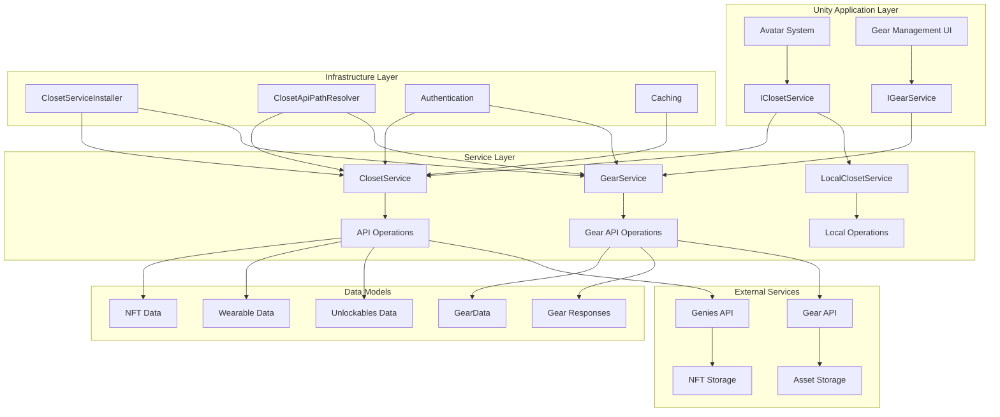

# Genies Closet Package Documentation

**Version:** 1.1.15  
**Unity Version:** 2022.3.32f1 or higher  
**Namespace:** `Genies.Closet`

## Overview

The **Genies Closet** package provides comprehensive avatar closet management functionality, enabling users to manage their collection of virtual wearables, NFTs, and collectible items. This package serves as the bridge between Unity applications and the Genies platform's closet services, offering both remote API integration and local development support.

## Package Structure

```
Genies.Closet/
├── Runtime/
│   ├── Closet/                    # Core closet services
│   │   ├── IClosetService.cs      # Main service interface
│   │   ├── ClosetService.cs       # Remote API implementation
│   │   ├── LocalClosetService.cs  # Local development implementation
│   │   ├── ClosetServiceInstaller.cs # Dependency injection setup
│   │   └── ClosetApiPathResolver.cs   # API endpoint configuration
│   └── Gear/                      # Gear management services
│       ├── IGearService.cs        # Gear service interface
│       ├── GearService.cs         # Gear API implementation
│       └── GearData.cs           # Gear data model
└── Documentation/
    └── Genies Closet.md          # This documentation
```

## Key Features

### 👗 **Closet Management**
- Complete virtual wardrobe management system
- NFT and wearable item collection tracking
- Unlockable items and achievement rewards
- Real-time closet synchronization with remote services

### 🎮 **Gear System Integration**
- Comprehensive gear creation and management
- Version control and status tracking
- Content management system integration
- Review and approval workflow support

### 🔄 **Service Architecture**
- Interface-driven design for flexible implementations
- Remote API integration with caching support
- Local development and testing capabilities
- Dependency injection framework integration

### 🌐 **Multi-Environment Support**
- Development, QA, and production environment configurations
- Secure API endpoint management
- Authentication and authorization integration
- Error handling and logging support

## Architecture Overview



## Core Services

### Closet Management Service

#### `IClosetService` Interface
The primary interface for managing user closet operations:

```csharp
public interface IClosetService
{
    // NFT Management
    UniTask<List<string>> GetOwnedNftGuids();
    UniTask<List<NftInfo>> GetOwnedNftInfo();
    UniTask<List<UnlockablesInfo>> GetOwnedUnlockablesInfo();
    
    // Closet Operations
    UniTask<ClosetItemResponse> GetClosetItems();
    
    // Wearable Management
    UniTask AddWearableToCloset(string wearableId, string fullAssetName);
    UniTask AddWearableToCloset(string wearableId, string fullAssetName, string createdBy);
    
    // Item Removal
    UniTask RemoveWearableFromCloset(string wearableId);
    UniTask RemoveAllWearablesFromCloset();
    UniTask RemoveThingFromCloset(string thingId);
    
    // Advanced Operations
    UniTask AddThingToCloset(string thingId);
    UniTask<List<string>> GetOwnedThingsIds();
    
    // Nested Data Structures
    public struct NftInfo
    {
        public string Guid { get; set; }
        public int? Id { get; set; }
    }
    
    public struct UnlockablesInfo
    {
        public string UnlockableId { get; set; }
        public int Amount { get; set; }
    }
}
```

**Service Features:**
- **NFT Integration**: Complete NFT ownership tracking and management
- **Wearable System**: Add, remove, and manage virtual clothing items
- **Collectibles**: Support for "things" - collectible virtual items
- **Unlockables**: Achievement-based reward system integration
- **Batch Operations**: Efficient bulk operations for closet management

### Gear Management Service

#### `IGearService` Interface
Interface for managing gear items (wearables and collectibles):

```csharp
public interface IGearService
{
    // Gear Retrieval
    UniTask<GearListResponse> GetGearListAsync(string cursor = null, decimal? limit = null);
    UniTask<GearGetByIdsResponse> GetGearsByIdsAsync(List<string> gearIds);
    
    // Gear Management
    UniTask<GearCreateResponse> CreateGearAsync(GearCreateRequest body);
    UniTask<MessageResponse> UpdateGearAsync(GearUpdateRequest body, string gearId);
}
```

**Gear Service Features:**
- **Pagination Support**: Cursor-based pagination for large gear collections
- **Bulk Operations**: Retrieve multiple gear items by ID in single requests
- **Creation Workflow**: Complete gear creation with metadata and assets
- **Update Operations**: Modify existing gear properties and content

## Usage Examples

### Basic Closet Operations

```csharp
public class ClosetManager : MonoBehaviour
{
    [Inject] private IClosetService _closetService;
    
    public async UniTask DisplayUserCloset()
    {
        try
        {
            // Get all closet items
            var closetItems = await _closetService.GetClosetItems();
            
            Debug.Log($"User has {closetItems.Wearables?.Count ?? 0} wearables");
            Debug.Log($"User has {closetItems.Things?.Count ?? 0} collectible items");
            
            // Get NFT information
            var nftInfo = await _closetService.GetOwnedNftInfo();
            foreach (var nft in nftInfo)
            {
                Debug.Log($"NFT: {nft.Guid} (ID: {nft.Id})");
            }
            
            // Get unlockable rewards
            var unlockables = await _closetService.GetOwnedUnlockablesInfo();
            foreach (var unlockable in unlockables)
            {
                Debug.Log($"Unlockable: {unlockable.UnlockableId} x{unlockable.Amount}");
            }
        }
        catch (Exception ex)
        {
            Debug.LogError($"Failed to load closet: {ex.Message}");
        }
    }
}
```

### Managing Wearables

```csharp
public class WearableManager : MonoBehaviour
{
    [Inject] private IClosetService _closetService;
    
    public async UniTask AddWearableToCloset(string wearableId, string assetName)
    {
        try
        {
            await _closetService.AddWearableToCloset(wearableId, assetName);
            Debug.Log($"Added wearable {wearableId} to closet");
            
            // Refresh closet display
            await RefreshClosetDisplay();
        }
        catch (Exception ex)
        {
            Debug.LogError($"Failed to add wearable: {ex.Message}");
        }
    }
    
    public async UniTask RemoveWearableFromCloset(string wearableId)
    {
        try
        {
            await _closetService.RemoveWearableFromCloset(wearableId);
            Debug.Log($"Removed wearable {wearableId} from closet");
            
            await RefreshClosetDisplay();
        }
        catch (Exception ex)
        {
            Debug.LogError($"Failed to remove wearable: {ex.Message}");
        }
    }
    
    private async UniTask RefreshClosetDisplay()
    {
        var closetItems = await _closetService.GetClosetItems();
        // Update UI with new closet contents
        UpdateClosetUI(closetItems);
    }
}
```

## Configuration and Setup

### Dependency Injection Setup

The package uses VContainer for dependency injection:

```csharp
[AutoResolve]
public class ClosetServiceInstaller : IGeniesInstaller
{
    public void Install(IContainerBuilder builder)
    {
        builder.Register<IClosetService, ClosetService>(Lifetime.Singleton);
    }
}
```

### API Configuration

The package includes environment-aware API configuration:

```csharp
public class ClosetApiPathResolver : IApiClientPathResolver
{
    public string GetApiBaseUrl(BackendEnvironment environment)
    {
        switch (environment)
        {
            case BackendEnvironment.QA:
                return "https://api.qa.genies.com";
            case BackendEnvironment.Prod:
                return "https://api.genies.com";
            case BackendEnvironment.Dev:
                return "https://api.dev.genies.com";
            default:
                throw new ArgumentOutOfRangeException(nameof(environment));
        }
    }
}
```

### Service Registration

```csharp
public class ClosetManager : MonoBehaviour
{
    [Inject] private IClosetService _closetService;
    [Inject] private IGearService _gearService;
    
    private void Start()
    {
        // Services are automatically injected and ready to use
        LoadUserCloset();
    }
    
    private async void LoadUserCloset()
    {
        try
        {
            var closetItems = await _closetService.GetClosetItems();
            Debug.Log($"Loaded {closetItems.Wearables?.Count ?? 0} wearables");
        }
        catch (Exception ex)
        {
            Debug.LogError($"Failed to load closet: {ex.Message}");
        }
    }
}
```

## Dependencies and Integration

### Core Dependencies
- **com.genies.thirdparty.unitask** (1.1.0): Asynchronous operations support
- **com.genies.login** (1.3.1): Authentication and user management
- **com.genies.servicemanagement** (1.1.1): Dependency injection framework
- **com.genies.services** (2.0.11): Base service infrastructure and API clients
- **com.genies.thirdparty.vcontainer** (1.1.1): Dependency injection container
- **com.genies.login.native** (1.7.1): Native authentication implementation
- **com.genies.utilities** (1.5.0): Utility functions and extensions
- **com.genies.crashreporting** (1.0.0): Error reporting and logging

### Best Practices

#### Service Usage
- **Dependency Injection**: Always use dependency injection for service access
- **Error Handling**: Implement comprehensive error handling for all operations
- **Caching**: Leverage caching for frequently accessed data
- **Authentication**: Ensure proper authentication before service calls

#### Performance Optimization
- **Batch Operations**: Use batch operations when possible to reduce API calls
- **Caching Strategy**: Implement appropriate caching with cache invalidation
- **Async Patterns**: Always use async/await patterns with UniTask
- **Resource Management**: Properly dispose of resources and avoid memory leaks

#### Development Workflow
- **Local Services**: Use LocalClosetService for offline development
- **Mock Data**: Create mock services for unit testing
- **Environment Configuration**: Use appropriate API environments for testing
- **Logging**: Implement comprehensive logging for debugging and monitoring

## Conclusion

The **Genies Closet** package provides a comprehensive solution for managing virtual wardrobes and collectible items within the Genies ecosystem. Its service-oriented architecture, comprehensive API integration, and flexible configuration options make it suitable for both simple closet management and complex avatar customization systems.

The package's dual service approach (remote and local) enables development flexibility, while its comprehensive error handling and caching support ensure reliable production performance. Integration with other Genies packages provides a complete avatar management solution.

For additional support, questions, or advanced integration scenarios, please refer to the package changelog or contact the Genies engineering team.
