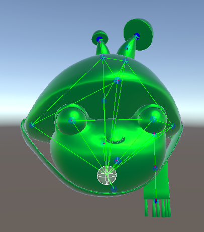
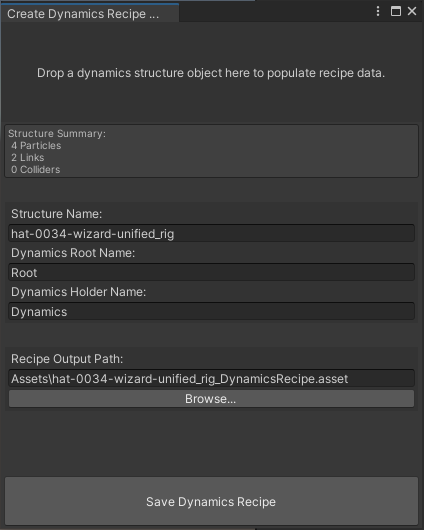

 

# Installation
1. In the Unity Editor main menu click Genies -> Components -> Genies Package Manager
2. Find "Genies Dynamics" and click on it to install the package.

# Quick Start
1. Add a Dynamics Structure component to a game object.
2. Add one or more Dynamics Particle components on game objects that are children of the Dynamic Structure.
3. (Optional) Add one or more Dynamics Link components on game objects that are children of the Dynamic Structure. Set their start and end particles.
4. (Optional) Add Dynamics Sphere Colliders or Dynamics Capsule Colliders to game objects that are children of the Dynamic Structure.
5. In the main menu, run Genies -> Editor Tools -> Populate Dynamics Structure. This adds references to all particles, links, and colliders to the Dynamics Structure.
6. Set Dynamics Structure properties such as Gravity and Friction.
7. Set the position anchor of at least one particle to a high value so that the structure doesn't fall away.
8. Enter play mode.

# Naming Conventions
Joints with dynamic particle components should be named in accordance with Mixamo joint naming conventions:

*Side + Name + Chain Index + "Dyn" + Joint Index*

* *Side* is "Left", "Center", or "Right".
* *Name* is a good descriptor of the object the joint belongs to. This name should contain only letters.
* *Chain Index* is a single digit number that differentiates chains when there are multiple chains per side.
* *"Dyn"* signifies that this particle is part of a dynamics system.
* *Joint Index* is a single digit number that denotes the order of a particle in a chain.

An example of a hair style with two braids on each side and one in the center would be:

*LeftHair0Dyn0 -> LeftHair0Dyn1*

*LeftHair1Dyn0 -> LeftHair1Dyn1*

*CenterHair0Dyn0 -> CenterHair0Dyn1*

*RightHair0Dyn0 -> RightHair0Dyn1*

*RightHair1Dyn0 -> RightHair1Dyn1*

# Dynamics Recipes
In order for Dynamics Structures to be transmitted and built at runtime, a Dynamics Recipe must be created.
This recipe contains all information needed to create the structure.

There is a custom utility that will create a recipe from an existing dynamics structure that has been prototyped in the scene view.
It can be found under the menu Genies -> Editor Tools -> Dynamics -> Create Dynamics Recipe From Structure.

A Dynamics Structure object can be dragged and dropped onto this window to populate the recipe data.
