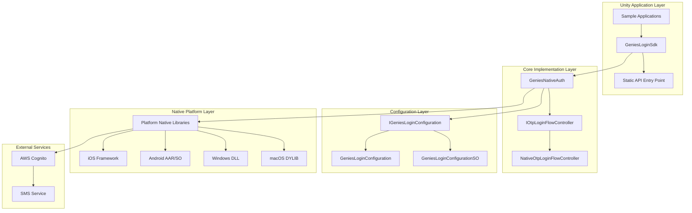

# Genies Login Native Package Documentation

**Version:** 1.7.1  
**Unity Version:** 2022.3.32f1 or higher  
**Namespace:** `Genies.Login.Native`

## Overview

The **Genies Login Native** package provides platform-native authentication capabilities through AWS Cognito integration. This package enables secure user authentication using One-Time Passwords (OTP) delivered via SMS, with support for iOS, Android, Windows, and macOS platforms. The package bridges Unity applications with native authentication libraries, providing a seamless login experience while maintaining security best practices.

## Package Structure

```
Genies.Login.Native/
├── Runtime/
│   ├── Scripts/             # Core C# implementation
│   │   ├── Config/          # Configuration classes
│   │   ├── Otp/            # OTP authentication flow
│   │   ├── GeniesLoginSdk.cs     # Static SDK entry point
│   │   └── GeniesNativeAuth.cs   # Native implementation
│   └── Plugins/            # Platform-specific native libraries
│       ├── Android/        # Android .aar and .so files
│       ├── iOS/           # iOS .framework
│       ├── MacOS/         # macOS .dylib
│       └── Windows/       # Windows .dll
├── Samples~/
│   ├── TestHarness/       # Comprehensive testing sample
│   └── UISample/          # UI implementation example
└── Documentation/
    └── Genies Login Native.md  # This documentation
```

## Key Features

### 🔐 **Native Authentication**
- Platform-specific native library integration
- AWS Cognito authentication backend
- Secure credential storage and token management
- Multi-platform support (iOS, Android, Windows, macOS)

### 📱 **OTP (One-Time Password) Flow**
- Phone number-based authentication
- SMS delivery of verification codes
- Code verification and user authentication
- Automatic token refresh and session management

### ⚙️ **Flexible Configuration**
- Unity ScriptableObject-based configuration
- Platform-specific client ID management
- Environment-aware settings (development, production)
- Injectable configuration for different deployment scenarios

### 🧪 **Development Support**
- Comprehensive sample implementations
- Test harness for development and debugging
- UI samples demonstrating best practices
- Error handling and logging integration

## Architecture Overview



## Core Components

### SDK Entry Point

#### `GeniesLoginSdk` Static Class
The primary interface for Unity applications:

```csharp
public static class GeniesLoginSdk
{
    // Initialization State
    public static bool IsInitialized { get; }
    
    // Authentication Tokens
    public static string RefreshToken { get; }
    public static string AuthIdToken { get; }
    public static string AuthAccessToken { get; }
    
    // Core Operations
    public static UniTask Initialize(IGeniesLoginConfiguration configuration);
    public static UniTask<bool> TryInstantLogin();
    public static void Shutdown();
    public static void ClearCachedCredentials();
    
    // OTP Authentication Flow
    public static IOtpLoginFlowController CreateOtpLoginFlow();
    
    // User Management
    public static UniTask<bool> TryRefreshTokens();
    public static UniTask Logout();
    
    // Events
    public static event Action UserLoggedIn;
    public static event Action UserLoggedOut;
    public static event Action<string> TokenRefreshed;
}
```

**Key Features:**
- **Static Access**: Single point of entry for all authentication operations
- **Asynchronous Operations**: UniTask-based API for non-blocking operations
- **Event System**: Observable authentication state changes
- **Token Management**: Automatic token refresh and credential caching

### Native Implementation

#### `GeniesNativeAuth` Class
Core native authentication implementation:

```csharp
public class GeniesNativeAuth : IGeniesLogin
{
    // Properties
    public bool IsInitialized { get; }
    public string RefreshToken { get; }
    public string AuthIdToken { get; }
    public string AuthAccessToken { get; }
    
    // Events
    public event Action UserLoggedIn;
    public event Action UserLoggedOut;
    public event Action<string> TokenRefreshed;
    
    // Core Methods
    public Task Initialize(IGeniesLoginConfiguration configuration);
    public Task<bool> TryInstantLogin();
    public Task<bool> TryRefreshTokens();
    public Task Logout();
    public void ClearCachedCredentials();
    public void Shutdown();
    
    // OTP Flow
    public IOtpLoginFlowController CreateOtpLoginFlow();
}
```

**Implementation Details:**
- **Native Interop**: Direct communication with platform native libraries
- **Thread Safety**: Proper synchronization for Unity's main thread
- **Error Handling**: Comprehensive exception handling and logging
- **Platform Abstraction**: Unified API across all supported platforms

### OTP Authentication Flow

#### `IOtpLoginFlowController` Interface
Manages the step-by-step OTP authentication process:

```csharp
public interface IOtpLoginFlowController
{
    // Phone Number Submission
    Task SubmitPhoneNumber(string phoneNumber);
    
    // OTP Code Operations
    Task SubmitOtpCode(string otpCode);
    Task ResendOtpCode();
    
    // State Management
    bool CanSubmitPhoneNumber();
    bool CanSubmitOtpCode();
    bool CanResendOtpCode();
}
```

#### `NativeOtpLoginFlowController` Implementation
Concrete implementation of the OTP flow:

```csharp
public sealed class NativeOtpLoginFlowController : IOtpLoginFlowController
{
    // Constructor
    internal NativeOtpLoginFlowController(GeniesNativeAuth auth);
    
    // Implementation of IOtpLoginFlowController
    public async Task SubmitPhoneNumber(string phoneNumber);
    public async Task SubmitOtpCode(string otpCode);
    public async Task ResendOtpCode();
    public bool CanSubmitPhoneNumber();
    public bool CanSubmitOtpCode();
    public bool CanResendOtpCode();
}
```

**Flow Management:**
- **State Tracking**: Maintains current step in authentication flow
- **Validation**: Ensures proper sequence of operations
- **Error Recovery**: Handles network failures and invalid inputs
- **User Experience**: Provides feedback for UI state management

### Configuration System

#### `IGeniesLoginConfiguration` Interface
Defines configuration contract:

```csharp
public interface IGeniesLoginConfiguration
{
    string ClientName { get; }
    string CognitoClientId { get; }
    string AppClientId { get; }
    string AppClientSecret { get; }
    LoginClientDatum[] ExtraClientData { get; }
    bool EnableLogging { get; }
    bool AllowUserSignUp { get; }
}
```

#### `GeniesLoginConfiguration` Class
Runtime configuration implementation:

```csharp
public class GeniesLoginConfiguration : IGeniesLoginConfiguration
{
    public GeniesLoginConfiguration(
        string clientName,
        string cognitoClientId,
        string appClientId,
        string appClientSecret,
        LoginClientDatum[] extraClientData = null,
        bool enableLogging = false,
        bool allowUserSignUp = true);
}
```

#### `GeniesLoginConfigurationSO` ScriptableObject
Unity Inspector-friendly configuration:

```csharp
[CreateAssetMenu(fileName = "GeniesLoginConfiguration", 
                 menuName = "Genies/Configurations/GeniesLoginConfiguration")]
public class GeniesLoginConfigurationSO : ScriptableObject, IGeniesLoginConfiguration
{
    // Platform-Specific Configuration
    private enum CognitoPlatform { Android, iOS, Editor }
    
    // Inspector Fields
    [SerializeField] private string clientName;
    [SerializeField] private string appClientId;
    [SerializeField] private string appClientSecret;
    [SerializeField] private CognitoClientIdPerPlatform[] cognitoClientIds;
    [SerializeField] private LoginClientDatum[] extraClientData;
    [SerializeField] private bool enableLogging;
    [SerializeField] private bool allowUserSignUp;
}
```

**Configuration Features:**
- **Platform-Specific**: Different Cognito client IDs per platform
- **Inspector Integration**: Easy setup through Unity Inspector
- **Validation**: Built-in validation for required fields
- **Environment Support**: Separate configurations for dev/staging/production

## Platform Integration

### Native Library Structure

The package includes platform-specific native libraries that handle the actual authentication:

#### iOS Integration
- **Framework**: `GeniesUnifiedLogin.framework`
- **Location**: `Runtime/Plugins/iOS/`
- **Features**: iOS Keychain integration, native UI support
- **Requirements**: iOS 12.0+, Xcode build settings

#### Android Integration  
- **Libraries**: `AndroidHelper.aar`, `libGeniesUnifiedLogin.so`
- **Location**: `Runtime/Plugins/Android/`
- **Features**: Android KeyStore integration, native authentication
- **Requirements**: Android API level 21+, NDK support

#### Windows Integration
- **Library**: `GeniesUnifiedLogin.dll`
- **Location**: `Runtime/Plugins/Windows/`
- **Features**: Windows Credential Manager integration
- **Requirements**: Windows 10+, .NET Framework support

#### macOS Integration
- **Library**: `libGeniesUnifiedLogin.dylib`
- **Location**: `Runtime/Plugins/MacOS/`
- **Features**: macOS Keychain integration
- **Requirements**: macOS 10.15+

### Platform-Specific Considerations

#### iOS
- **Info.plist Configuration**: May require URL scheme registration
- **Keychain Access**: Automatic secure storage of credentials
- **App Transport Security**: Ensure HTTPS endpoints are configured

#### Android
- **Manifest Configuration**: Internet and SMS permissions
- **ProGuard**: Native library obfuscation considerations
- **API Key Security**: Secure storage in native layer

#### Desktop Platforms
- **Credential Storage**: OS-native secure storage mechanisms
- **Network Security**: Certificate validation and secure connections
- **Platform APIs**: Integration with OS authentication systems

## Configuration and Setup

### Step 1: Create Configuration Asset

1. **Create ScriptableObject Configuration**:
   ```
   Right-click in Project → Create → Genies → Configurations → GeniesLoginConfiguration
   ```

2. **Configure Platform Settings**:
   ```csharp
   // In the Inspector, configure:
   - Client Name: "YourAppName"
   - App Client ID: "your-app-client-id"
   - App Client Secret: "your-app-client-secret"
   - Cognito Client IDs: Platform-specific IDs
   - Enable Logging: True (for development)
   - Allow User Sign Up: True
   ```

### Step 2: Initialize SDK

```csharp
public class LoginManager : MonoBehaviour
{
    [SerializeField] private GeniesLoginConfigurationSO configuration;
    
    private async void Start()
    {
        try
        {
            await GeniesLoginSdk.Initialize(configuration);
            Debug.Log("Login SDK initialized successfully");
            
            // Try instant login for returning users
            var instantLoginSuccess = await GeniesLoginSdk.TryInstantLogin();
            if (instantLoginSuccess)
            {
                Debug.Log("User automatically logged in");
                OnUserLoggedIn();
            }
        }
        catch (Exception ex)
        {
            Debug.LogError($"Failed to initialize Login SDK: {ex.Message}");
        }
    }
    
    private void OnEnable()
    {
        GeniesLoginSdk.UserLoggedIn += OnUserLoggedIn;
        GeniesLoginSdk.UserLoggedOut += OnUserLoggedOut;
        GeniesLoginSdk.TokenRefreshed += OnTokenRefreshed;
    }
    
    private void OnDisable()
    {
        GeniesLoginSdk.UserLoggedIn -= OnUserLoggedIn;
        GeniesLoginSdk.UserLoggedOut -= OnUserLoggedOut;
        GeniesLoginSdk.TokenRefreshed -= OnTokenRefreshed;
    }
}
```

### Step 3: AWS Cognito Setup

1. **Create Cognito User Pool**:
   ```bash
   # AWS CLI example
   aws cognito-idp create-user-pool \
     --pool-name "YourAppUserPool" \
     --auto-verified-attributes phone_number \
     --mfa-configuration ON
   ```

2. **Configure SMS Settings**:
   - Set up SMS role in AWS IAM
   - Configure SMS message template
   - Set rate limiting and cost controls

3. **Create App Client**:
   ```bash
   aws cognito-idp create-user-pool-client \
     --user-pool-id your-pool-id \
     --client-name "YourAppClient" \
     --explicit-auth-flows ALLOW_CUSTOM_AUTH ALLOW_SRP_AUTH
   ```

## Usage Examples

### Basic OTP Authentication Flow

```csharp
public class OTPLoginUI : MonoBehaviour
{
    [SerializeField] private TMP_InputField phoneNumberInput;
    [SerializeField] private TMP_InputField otpCodeInput;
    [SerializeField] private Button submitPhoneButton;
    [SerializeField] private Button submitOtpButton;
    [SerializeField] private Button resendOtpButton;
    
    private IOtpLoginFlowController _otpController;
    
    public async void OnSubmitPhoneNumber()
    {
        if (!GeniesLoginSdk.IsInitialized)
        {
            Debug.LogError("SDK not initialized");
            return;
        }
        
        _otpController = GeniesLoginSdk.CreateOtpLoginFlow();
        
        try
        {
            await _otpController.SubmitPhoneNumber(phoneNumberInput.text);
            Debug.Log("OTP sent to phone number");
            ShowOtpInputUI();
        }
        catch (Exception ex)
        {
            Debug.LogError($"Failed to send OTP: {ex.Message}");
            ShowErrorMessage("Failed to send verification code. Please try again.");
        }
    }
    
    public async void OnSubmitOtpCode()
    {
        if (_otpController == null || !_otpController.CanSubmitOtpCode())
            return;
            
        try
        {
            await _otpController.SubmitOtpCode(otpCodeInput.text);
            Debug.Log("OTP verified successfully - user logged in");
            ShowLoggedInUI();
        }
        catch (Exception ex)
        {
            Debug.LogError($"OTP verification failed: {ex.Message}");
            ShowErrorMessage("Invalid verification code. Please try again.");
        }
    }
    
    public async void OnResendOtp()
    {
        if (_otpController == null || !_otpController.CanResendOtpCode())
            return;
            
        try
        {
            await _otpController.ResendOtpCode();
            Debug.Log("New OTP sent");
            ShowMessage("New verification code sent to your phone.");
        }
        catch (Exception ex)
        {
            Debug.LogError($"Failed to resend OTP: {ex.Message}");
        }
    }
}
```

### Advanced Authentication Management

```csharp
public class AdvancedLoginManager : MonoBehaviour
{
    private CancellationTokenSource _cancellationTokenSource;
    
    public async UniTask<bool> PerformSecureLogin(string phoneNumber, CancellationToken cancellationToken = default)
    {
        // Combine with external token source
        using var linkedTokenSource = CancellationTokenSource.CreateLinkedTokenSource(cancellationToken);
        
        try
        {
            var otpController = GeniesLoginSdk.CreateOtpLoginFlow();
            
            // Step 1: Submit phone number
            await otpController.SubmitPhoneNumber(phoneNumber);
            
            // Step 2: Wait for user to enter OTP (this would be UI-driven)
            var otpCode = await WaitForUserOtpInput(linkedTokenSource.Token);
            
            // Step 3: Submit OTP code
            await otpController.SubmitOtpCode(otpCode);
            
            // Step 4: Verify tokens are valid
            var refreshSuccess = await GeniesLoginSdk.TryRefreshTokens();
            if (!refreshSuccess)
            {
                throw new InvalidOperationException("Failed to verify authentication tokens");
            }
            
            return true;
        }
        catch (OperationCanceledException)
        {
            Debug.Log("Login operation was cancelled");
            return false;
        }
        catch (Exception ex)
        {
            Debug.LogError($"Login failed: {ex.Message}");
            return false;
        }
    }
    
    public async UniTask<string> GetValidAccessToken()
    {
        if (!GeniesLoginSdk.IsInitialized)
        {
            throw new InvalidOperationException("SDK not initialized");
        }
        
        // Check if we have a valid token
        var currentToken = GeniesLoginSdk.AuthAccessToken;
        if (!string.IsNullOrEmpty(currentToken))
        {
            // Attempt to refresh if needed
            var refreshed = await GeniesLoginSdk.TryRefreshTokens();
            if (refreshed)
            {
                return GeniesLoginSdk.AuthAccessToken;
            }
        }
        
        // No valid token available
        throw new UnauthorizedAccessException("No valid authentication token available");
    }
    
    private async UniTask<string> WaitForUserOtpInput(CancellationToken cancellationToken)
    {
        // This is a simplified example - in practice, this would be UI-driven
        var tcs = new UniTaskCompletionSource<string>();
        
        // Register for cancellation
        cancellationToken.Register(() => tcs.TrySetCanceled());
        
        // In a real implementation, this would be connected to UI events
        // For example: otpInputField.onEndEdit.AddListener(code => tcs.TrySetResult(code));
        
        return await tcs.Task;
    }
}
```

### Token Management and API Integration

```csharp
public class AuthenticatedApiClient : MonoBehaviour
{
    private readonly HttpClient _httpClient = new HttpClient();
    
    public async UniTask<string> MakeAuthenticatedRequest(string endpoint, string jsonData = null)
    {
        try
        {
            // Ensure we have a valid access token
            var accessToken = await GetValidAccessToken();
            
            // Configure request with authentication
            var request = new HttpRequestMessage(
                string.IsNullOrEmpty(jsonData) ? HttpMethod.Get : HttpMethod.Post, 
                endpoint);
                
            request.Headers.Authorization = new System.Net.Http.Headers.AuthenticationHeaderValue("Bearer", accessToken);
            
            if (!string.IsNullOrEmpty(jsonData))
            {
                request.Content = new StringContent(jsonData, System.Text.Encoding.UTF8, "application/json");
            }
            
            // Execute request
            var response = await _httpClient.SendAsync(request);
            response.EnsureSuccessStatusCode();
            
            return await response.Content.ReadAsStringAsync();
        }
        catch (UnauthorizedAccessException)
        {
            // Token invalid - redirect to login
            Debug.LogWarning("Authentication required - redirecting to login");
            ShowLoginUI();
            throw;
        }
        catch (HttpRequestException ex)
        {
            Debug.LogError($"API request failed: {ex.Message}");
            throw;
        }
    }
    
    private async UniTask<string> GetValidAccessToken()
    {
        if (!GeniesLoginSdk.IsInitialized)
        {
            throw new InvalidOperationException("Login SDK not initialized");
        }
        
        // Try to refresh tokens if needed
        var refreshSuccess = await GeniesLoginSdk.TryRefreshTokens();
        if (!refreshSuccess)
        {
            throw new UnauthorizedAccessException("Unable to refresh authentication tokens");
        }
        
        var accessToken = GeniesLoginSdk.AuthAccessToken;
        if (string.IsNullOrEmpty(accessToken))
        {
            throw new UnauthorizedAccessException("No valid access token available");
        }
        
        return accessToken;
    }
    
    private void ShowLoginUI()
    {
        // Implementation depends on your UI framework
        // Example: SceneManager.LoadScene("LoginScene");
    }
}
```

### Logout and Credential Management

```csharp
public class SessionManager : MonoBehaviour
{
    public async void PerformLogout()
    {
        try
        {
            await GeniesLoginSdk.Logout();
            Debug.Log("User logged out successfully");
            
            // Clear any cached user data
            PlayerPrefs.DeleteAll();
            
            // Navigate to login screen
            ShowLoginUI();
        }
        catch (Exception ex)
        {
            Debug.LogError($"Logout failed: {ex.Message}");
        }
    }
    
    public void ClearAllCredentials()
    {
        try
        {
            GeniesLoginSdk.ClearCachedCredentials();
            Debug.Log("All cached credentials cleared");
            
            // Clear additional local storage
            PlayerPrefs.DeleteAll();
            
            ShowLoginUI();
        }
        catch (Exception ex)
        {
            Debug.LogError($"Failed to clear credentials: {ex.Message}");
        }
    }
    
    public bool IsUserLoggedIn()
    {
        return GeniesLoginSdk.IsInitialized && 
               !string.IsNullOrEmpty(GeniesLoginSdk.AuthAccessToken);
    }
    
    private void OnApplicationPause(bool pauseStatus)
    {
        if (!pauseStatus && IsUserLoggedIn())
        {
            // App resumed - try to refresh tokens
            RefreshTokensOnResume();
        }
    }
    
    private async void RefreshTokensOnResume()
    {
        try
        {
            var refreshed = await GeniesLoginSdk.TryRefreshTokens();
            if (!refreshed)
            {
                Debug.LogWarning("Token refresh failed - user may need to re-authenticate");
                // Optionally prompt for re-authentication
            }
        }
        catch (Exception ex)
        {
            Debug.LogError($"Token refresh on resume failed: {ex.Message}");
        }
    }
}
```

## Error Handling

### Exception Types and Handling

The login system can throw various types of exceptions that should be handled appropriately:

```csharp
public class LoginErrorHandler
{
    public async UniTask<bool> SafeLoginOperation(Func<UniTask> loginOperation)
    {
        try
        {
            await loginOperation();
            return true;
        }
        catch (InvalidOperationException ex)
        {
            // SDK not initialized or invalid state
            Debug.LogError($"Invalid operation: {ex.Message}");
            ShowErrorMessage("Please restart the application and try again.");
            return false;
        }
        catch (UnauthorizedAccessException ex)
        {
            // Authentication failed or token expired
            Debug.LogError($"Authentication failed: {ex.Message}");
            ShowErrorMessage("Authentication failed. Please check your phone number and try again.");
            return false;
        }
        catch (TimeoutException ex)
        {
            // Network timeout or service unavailable
            Debug.LogError($"Request timeout: {ex.Message}");
            ShowErrorMessage("Request timed out. Please check your connection and try again.");
            return false;
        }
        catch (ArgumentException ex)
        {
            // Invalid input parameters
            Debug.LogError($"Invalid input: {ex.Message}");
            ShowErrorMessage("Please check your input and try again.");
            return false;
        }
        catch (Exception ex)
        {
            // Unexpected error
            Debug.LogError($"Unexpected error: {ex.Message}");
            ShowErrorMessage("An unexpected error occurred. Please try again later.");
            return false;
        }
    }
    
    private void ShowErrorMessage(string message)
    {
        // Implementation depends on your UI system
        Debug.LogWarning($"User Error: {message}");
    }
}
```

### Common Error Scenarios and Solutions

```csharp
public class LoginTroubleshooter
{
    public static async UniTask<bool> DiagnoseAndFixLoginIssues()
    {
        // Check SDK initialization
        if (!GeniesLoginSdk.IsInitialized)
        {
            Debug.LogError("SDK not initialized - attempting to initialize");
            // Attempt to reinitialize
            // return await ReinitializeSDK();
        }
        
        // Check network connectivity
        if (Application.internetReachability == NetworkReachability.NotReachable)
        {
            Debug.LogError("No internet connection available");
            return false;
        }
        
        // Check token validity
        if (!string.IsNullOrEmpty(GeniesLoginSdk.AuthAccessToken))
        {
            var refreshSuccess = await GeniesLoginSdk.TryRefreshTokens();
            if (!refreshSuccess)
            {
                Debug.LogWarning("Token refresh failed - clearing credentials");
                GeniesLoginSdk.ClearCachedCredentials();
            }
        }
        
        return true;
    }
}
```

## Dependencies and Requirements

### Core Dependencies
- **com.genies.thirdparty.unitask** (1.1.0): Asynchronous operations support
- **com.genies.login** (1.3.1): Base login interfaces and shared functionality
- **com.genies.servicemanagement** (1.1.1): Service management and dependency injection
- **com.genies.crashreporting** (1.0.0): Error reporting and logging
- **com.unity.textmeshpro** (3.0.8): UI text rendering for samples

### Platform Requirements

#### iOS
- **Minimum Version**: iOS 12.0+
- **Xcode Version**: 13.0+
- **Frameworks**: Foundation, Security, SystemConfiguration
- **Permissions**: Network access for API calls

#### Android
- **Minimum API Level**: 21 (Android 5.0)
- **Target API Level**: 33+
- **Permissions**: 
  ```xml
  <uses-permission android:name="android.permission.INTERNET" />
  <uses-permission android:name="android.permission.ACCESS_NETWORK_STATE" />
  ```
- **NDK Support**: Required for native library integration

#### Windows
- **Minimum Version**: Windows 10
- **Framework**: .NET Framework 4.7.1+
- **Architecture**: x64 support

#### macOS
- **Minimum Version**: macOS 10.15+
- **Architecture**: Intel and Apple Silicon support

## Best Practices

### SDK Lifecycle Management
- **Initialize Once**: Call `Initialize()` once at application startup
- **Event Handling**: Always subscribe/unsubscribe to events properly
- **Shutdown**: Call `Shutdown()` during application quit for cleanup

### Security Best Practices
- **Token Storage**: Never log authentication tokens in production
- **Configuration**: Store sensitive configuration data securely
- **Network**: Always use HTTPS endpoints for production
- **Input Validation**: Validate all user inputs, especially phone numbers

### Performance Optimization
- **Caching**: Leverage built-in token caching mechanisms
- **Background Operations**: Use proper async/await patterns
- **Memory Management**: Dispose of controllers and clients properly

### Error Handling
- **User-Friendly Messages**: Provide clear error messages to users
- **Logging**: Implement comprehensive logging for debugging
- **Recovery**: Implement automatic retry mechanisms where appropriate

## Conclusion

The **Genies Login Native** package provides a robust, secure, and cross-platform authentication solution using AWS Cognito and OTP verification. Its native library integration ensures optimal performance and security while maintaining a simple, Unity-friendly API.

The package's comprehensive sample implementations, flexible configuration system, and thorough error handling make it suitable for production applications requiring secure user authentication.

For additional support, questions, or issues, please refer to the package changelog, samples, or contact the Genies engineering team.
