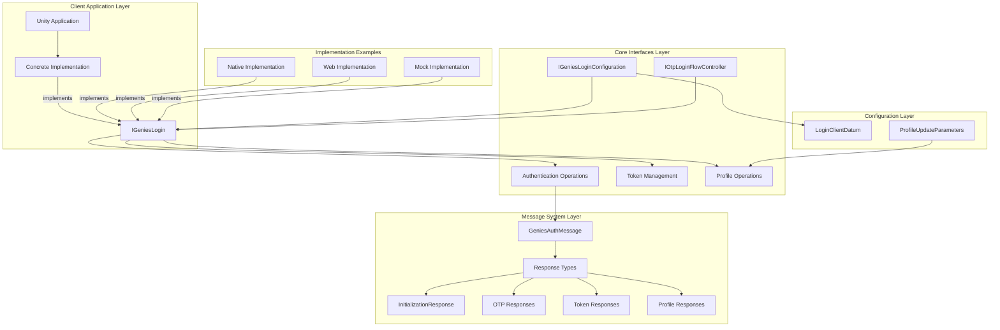

# Genies Login Package Documentation

**Version:** 1.3.3  
**Unity Version:** 2022.3.32f1 or higher  
**Namespace:** `Genies.Login`

## Overview

The **Genies Login** package serves as the foundational interface and messaging layer for authentication within the Genies ecosystem. This package defines the core contracts, data structures, and message types that concrete login implementations must implement. It provides a standardized API for authentication operations while allowing flexibility in implementation approaches across different platforms and authentication methods.

## Package Structure

```
Genies.Login/
├── Runtime/
│   ├── Config/                    # Configuration interfaces and data structures
│   │   ├── IGeniesLoginConfiguration.cs    # Main configuration contract
│   │   └── LoginClientDatum.cs            # Key-value configuration data
│   ├── MessageTypes/             # Authentication response message types
│   │   ├── GeniesAuthMessage.cs           # Base message class
│   │   ├── GeniesAuth*Response.cs         # Specific response types
│   │   └── GeniesAuthDictionaryMessage.cs # Dictionary-based messages
│   ├── Otp/                      # OTP authentication interfaces
│   │   └── IOtpLoginFlowController.cs     # OTP flow contract
│   ├── IGeniesLogin.cs           # Core login interface
│   └── ProfileUpdateParameters.cs         # User profile data structure
└── Documentation/
    └── Genies Login.md          # This documentation
```

## Key Features

### 🏗️ **Interface-Driven Architecture**
- Clean separation between contract and implementation
- Standardized API across all authentication methods
- Dependency injection friendly design
- Extensible for custom authentication providers

### 📡 **Comprehensive Message System**
- Structured response messages for all operations
- Consistent error handling and status reporting
- Serializable message types for Unity Inspector
- Type-safe status codes and error reporting

### 🔐 **Authentication Abstractions**
- OTP (One-Time Password) flow interface
- Token management and refresh operations
- User profile management capabilities
- Configuration-based initialization

### 🔧 **Flexible Configuration**
- Interface-based configuration system
- Support for multiple authentication backends
- Custom client data and parameters
- Environment-aware settings

## Architecture Overview



## Core Interfaces

### Primary Authentication Interface

#### `IGeniesLogin` Interface
The central contract defining all authentication operations:

```csharp
public interface IGeniesLogin
{
    // Authentication State
    bool IsInitialized { get; }
    string RefreshToken { get; set; }
    string AuthAccessToken { get; }
    string AuthIdToken { get; }
    
    // Events
    event Action UserLoggedIn;
    event Action UserLoggedOut;
    event Action<string> OnTokenRefresh;
    
    // Core Operations
    Task Initialize(IGeniesLoginConfiguration configuration);
    Task<bool> TryInstantLogin();
    Task<bool> TryRefreshTokens();
    Task Logout();
    void ClearCachedCredentials();
    void Shutdown();
    
    // OTP Authentication
    IOtpLoginFlowController CreateOtpLoginFlow();
    
    // Profile Management
    Task<ProfileUpdateParameters> GetProfileAsync();
    Task<bool> UpdateProfileAsync(ProfileUpdateParameters parameters);
    
    // Token Validation
    Task<bool> IsTokenValidAsync(CancellationToken cancellationToken = default);
}
```

**Interface Features:**
- **State Management**: Comprehensive initialization and authentication state tracking
- **Event System**: Observable authentication lifecycle events
- **Asynchronous Operations**: All operations return Tasks for non-blocking execution
- **Token Management**: Complete token lifecycle including refresh and validation
- **Profile Integration**: User profile retrieval and update capabilities

### Configuration Interface

#### `IGeniesLoginConfiguration` Interface
Defines the configuration contract for authentication setup:

```csharp
public interface IGeniesLoginConfiguration
{
    string ClientName { get; }              // Application identifier
    string CognitoClientId { get; }         // AWS Cognito client ID
    string AppClientId { get; }             // Application client ID  
    string AppClientSecret { get; }         // Secure client secret
    LoginClientDatum[] ExtraClientData { get; } // Custom configuration data
    bool EnableLogging { get; }             // Debug logging flag
    bool AllowSignUp { get; }              // User registration flag
}
```

**Configuration Properties:**
- **Identity Configuration**: Client identifiers for authentication backend
- **Security Settings**: Secure secrets and authentication parameters
- **Behavioral Settings**: Logging, sign-up permissions, and feature flags
- **Extensibility**: Custom data support for implementation-specific needs

### OTP Flow Interface

#### `IOtpLoginFlowController` Interface
Manages One-Time Password authentication flow:

```csharp
public interface IOtpLoginFlowController : IDisposable
{
    // Phone Number Operations
    Task<GeniesAuthInitiateOtpSignInResponse> SubmitPhoneNumberAsync(string phoneNumber);
    
    // OTP Code Operations  
    Task<GeniesAuthSendOtpResponse> SubmitOtpCodeAsync(string code);
    Task<GeniesAuthOtpRefreshResponse> ResendOtpCodeAsync();
}
```

**Flow Management:**
- **Step-by-Step Process**: Manages the complete OTP authentication sequence
- **State Validation**: Ensures proper flow progression and error handling
- **Disposable Pattern**: Proper resource cleanup and flow termination
- **Response Typing**: Type-safe responses for each operation phase

## Message System Architecture

### Base Message Class

#### `GeniesAuthMessage` Class
Foundation class for all authentication response messages:

```csharp
[Serializable]
public class GeniesAuthMessage : ISerializationCallbackReceiver
{
    // Status Properties
    public bool IsSuccessful => Status == "success";
    public string Status;
    public string Message;
    public string ErrorMessage;
    public string StatusCodeString = "None";
    
    // Serialization Support
    public void OnBeforeSerialize() { /* Implementation */ }
    public void OnAfterDeserialize() { /* Implementation */ }
    
    // String Representation
    public override string ToString() { /* Formatted output */ }
}
```

**Message Features:**
- **Consistent Structure**: Standardized success/failure reporting
- **Unity Integration**: Serializable for Inspector and debugging
- **Error Handling**: Comprehensive error message and status tracking
- **Debugging Support**: Formatted string representation for logging

### Response Message Types

The package includes specialized response messages for different operations:

#### Initialization Response
```csharp
public class GeniesAuthInitializationResponse : GeniesAuthMessage
{
    public bool UserSignedUp = false;
    public StatusCode statusCode = StatusCode.None;
    
    public enum StatusCode
    {
        None, InitializationSuccess, InitializationException,
        InitializationFailed, ConfigurationUpdated, Unknown
    }
}
```

#### OTP Flow Responses
```csharp
public class GeniesAuthInitiateOtpSignInResponse : GeniesAuthMessage
{
    public bool UserSignedUp = false;
    public StatusCode statusCode = StatusCode.None;
    
    public enum StatusCode
    {
        None, ValidSession, UserSignupFailed, InvalidPhoneNumber,
        UserLoggedOut, PhoneNumberSubmitted, PhoneNotSubmitted,
        UserNotSignedUp, Unknown
    }
}

public class GeniesAuthSendOtpResponse : GeniesAuthMessage
{
    public StatusCode statusCode = StatusCode.None;
    
    public enum StatusCode
    {
        None, CodeMatched, IncorrectCode, InvalidOtp,
        PhoneNumberNotVerified, Unknown
    }
}

public class GeniesAuthOtpRefreshResponse : GeniesAuthMessage
{
    public StatusCode statusCode = StatusCode.None;
    
    public enum StatusCode
    {
        None, OtpRefreshed, OtpNotRefreshed, Unknown
    }
}
```

#### Token Management Responses
```csharp
public class GeniesAuthTokenValidityResponse : GeniesAuthMessage
{
    public bool TokenValid = false;
    public StatusCode statusCode = StatusCode.None;
    
    public enum StatusCode
    {
        None, TokenValid, TokenInvalid, Unknown
    }
}

public class GeniesAuthForceTokenRefreshResponse : GeniesAuthMessage
{
    public StatusCode statusCode = StatusCode.None;
    
    public enum StatusCode
    {
        None, TokenRefreshed, TokenNotRefreshed, Unknown
    }
}
```

#### Session Management Responses
```csharp
public class GeniesAuthInstantLoginResponse : GeniesAuthMessage
{
    public StatusCode statusCode = StatusCode.None;
    
    public enum StatusCode
    {
        None, InstantLoginSuccess, InstantLoginFailed, Unknown
    }
}

public class GeniesAuthLogoutResponse : GeniesAuthMessage
{
    public StatusCode statusCode = StatusCode.None;
    
    public enum StatusCode
    {
        None, LogoutSuccess, LogoutFailed, Unknown
    }
}
```

## Data Structures

### Configuration Data

#### `LoginClientDatum` Class
Represents key-value configuration data:

```csharp
[Serializable]
public class LoginClientDatum
{
    public string Key;      // Configuration parameter name
    public string Value;    // Configuration parameter value
}
```

**Usage Examples:**
```csharp
var extraData = new LoginClientDatum[]
{
    new LoginClientDatum { Key = "environment", Value = "production" },
    new LoginClientDatum { Key = "region", Value = "us-west-2" },
    new LoginClientDatum { Key = "timeout", Value = "30" }
};
```

### Profile Management

#### `ProfileUpdateParameters` Struct
Comprehensive user profile data structure:

```csharp
public struct ProfileUpdateParameters
{
    // Basic Information
    public string Email { get; set; }
    public string PhoneNumber { get; set; }
    public string Username { get; set; }
    public string FirstName { get; set; }
    public string LastName { get; set; }
    
    // Extended Profile
    public string Bio { get; set; }
    public string Birthday { get; set; }
    public string ProfileImageUrl { get; set; }
    
    // Platform Integration
    public string GeniesId { get; set; }
    public string DollName { get; set; }
    
    // Blockchain Integration
    public string DapperId { get; set; }
    public string FlowAddress { get; set; }
    
    // Legal Information
    public string LegalFirstName { get; set; }
    public string LegalLastName { get; set; }
    
    // Metadata
    public int CreatedAt { get; set; }
    public int UpdatedAt { get; set; }
}
```

**Profile Features:**
- **Comprehensive Fields**: Complete user profile representation
- **Blockchain Support**: Integration with Flow blockchain and Dapper wallet
- **Legal Compliance**: Separate legal name fields for verification
- **Metadata Tracking**: Creation and update timestamps
- **Avatar Integration**: Doll/avatar name association

## Implementation Guidelines

### Creating a Custom Implementation

To implement the `IGeniesLogin` interface:

```csharp
public class CustomLoginImplementation : IGeniesLogin
{
    // State Properties
    public bool IsInitialized { get; private set; }
    public string RefreshToken { get; set; }
    public string AuthAccessToken { get; private set; }
    public string AuthIdToken { get; private set; }
    
    // Events
    public event Action UserLoggedIn;
    public event Action UserLoggedOut;
    public event Action<string> OnTokenRefresh;
    
    // Implementation Methods
    public async Task Initialize(IGeniesLoginConfiguration configuration)
    {
        // Initialize authentication system with provided configuration
        try
        {
            // Setup authentication backend
            await SetupAuthenticationBackend(configuration);
            
            // Validate configuration
            ValidateConfiguration(configuration);
            
            IsInitialized = true;
            
            return new GeniesAuthInitializationResponse
            {
                Status = "success",
                statusCode = GeniesAuthInitializationResponse.StatusCode.InitializationSuccess
            };
        }
        catch (Exception ex)
        {
            return new GeniesAuthInitializationResponse
            {
                Status = "failed",
                ErrorMessage = ex.Message,
                statusCode = GeniesAuthInitializationResponse.StatusCode.InitializationException
            };
        }
    }
    
    public async Task<bool> TryInstantLogin()
    {
        if (!IsInitialized)
            return false;
            
        try
        {
            // Attempt to use cached credentials
            var cachedTokens = await LoadCachedTokens();
            if (cachedTokens != null && await ValidateTokens(cachedTokens))
            {
                AuthAccessToken = cachedTokens.AccessToken;
                AuthIdToken = cachedTokens.IdToken;
                RefreshToken = cachedTokens.RefreshToken;
                
                UserLoggedIn?.Invoke();
                return true;
            }
        }
        catch (Exception ex)
        {
            Debug.LogError($"Instant login failed: {ex.Message}");
        }
        
        return false;
    }
    
    public IOtpLoginFlowController CreateOtpLoginFlow()
    {
        if (!IsInitialized)
            throw new InvalidOperationException("Login system not initialized");
            
        return new CustomOtpLoginFlowController(this);
    }
    
    // Additional implementation methods...
}
```

### Creating an OTP Flow Implementation

```csharp
public class CustomOtpLoginFlowController : IOtpLoginFlowController
{
    private readonly CustomLoginImplementation _loginSystem;
    private string _phoneNumber;
    private bool _isDisposed = false;
    
    public CustomOtpLoginFlowController(CustomLoginImplementation loginSystem)
    {
        _loginSystem = loginSystem ?? throw new ArgumentNullException(nameof(loginSystem));
    }
    
    public async Task<GeniesAuthInitiateOtpSignInResponse> SubmitPhoneNumberAsync(string phoneNumber)
    {
        if (_isDisposed)
            throw new ObjectDisposedException(nameof(CustomOtpLoginFlowController));
            
        try
        {
            // Validate phone number format
            if (!ValidatePhoneNumber(phoneNumber))
            {
                return new GeniesAuthInitiateOtpSignInResponse
                {
                    Status = "failed",
                    ErrorMessage = "Invalid phone number format",
                    statusCode = GeniesAuthInitiateOtpSignInResponse.StatusCode.InvalidPhoneNumber
                };
            }
            
            // Submit phone number to authentication backend
            await SubmitPhoneNumberToBackend(phoneNumber);
            _phoneNumber = phoneNumber;
            
            return new GeniesAuthInitiateOtpSignInResponse
            {
                Status = "success",
                statusCode = GeniesAuthInitiateOtpSignInResponse.StatusCode.PhoneNumberSubmitted
            };
        }
        catch (Exception ex)
        {
            return new GeniesAuthInitiateOtpSignInResponse
            {
                Status = "failed",
                ErrorMessage = ex.Message,
                statusCode = GeniesAuthInitiateOtpSignInResponse.StatusCode.Unknown
            };
        }
    }
    
    public async Task<GeniesAuthSendOtpResponse> SubmitOtpCodeAsync(string code)
    {
        if (_isDisposed)
            throw new ObjectDisposedException(nameof(CustomOtpLoginFlowController));
            
        if (string.IsNullOrEmpty(_phoneNumber))
        {
            return new GeniesAuthSendOtpResponse
            {
                Status = "failed",
                ErrorMessage = "Phone number not submitted",
                statusCode = GeniesAuthSendOtpResponse.StatusCode.PhoneNumberNotVerified
            };
        }
        
        try
        {
            // Verify OTP code with authentication backend
            var verificationResult = await VerifyOtpCode(_phoneNumber, code);
            
            if (verificationResult.IsSuccess)
            {
                // Update login system with new tokens
                _loginSystem.UpdateTokens(verificationResult.Tokens);
                
                return new GeniesAuthSendOtpResponse
                {
                    Status = "success",
                    statusCode = GeniesAuthSendOtpResponse.StatusCode.CodeMatched
                };
            }
            else
            {
                return new GeniesAuthSendOtpResponse
                {
                    Status = "failed",
                    ErrorMessage = "Invalid verification code",
                    statusCode = GeniesAuthSendOtpResponse.StatusCode.IncorrectCode
                };
            }
        }
        catch (Exception ex)
        {
            return new GeniesAuthSendOtpResponse
            {
                Status = "failed",
                ErrorMessage = ex.Message,
                statusCode = GeniesAuthSendOtpResponse.StatusCode.Unknown
            };
        }
    }
    
    public void Dispose()
    {
        if (!_isDisposed)
        {
            _phoneNumber = null;
            _isDisposed = true;
        }
    }
}
```

## Usage Patterns

### Configuration Setup

```csharp
public class LoginConfigurationExample : MonoBehaviour, IGeniesLoginConfiguration
{
    [SerializeField] private string clientName = "MyApp";
    [SerializeField] private string cognitoClientId = "your-cognito-client-id";
    [SerializeField] private string appClientId = "your-app-client-id";
    [SerializeField] private string appClientSecret = "your-app-client-secret";
    [SerializeField] private bool enableLogging = true;
    [SerializeField] private bool allowSignUp = true;
    
    public string ClientName => clientName;
    public string CognitoClientId => cognitoClientId;
    public string AppClientId => appClientId;
    public string AppClientSecret => appClientSecret;
    public bool EnableLogging => enableLogging;
    public bool AllowSignUp => allowSignUp;
    
    public LoginClientDatum[] ExtraClientData => new LoginClientDatum[]
    {
        new LoginClientDatum { Key = "environment", Value = Application.isEditor ? "development" : "production" },
        new LoginClientDatum { Key = "version", Value = Application.version },
        new LoginClientDatum { Key = "platform", Value = Application.platform.ToString() }
    };
}
```

### Implementing Authentication Logic

```csharp
public class AuthenticationManager : MonoBehaviour
{
    [SerializeField] private LoginConfigurationExample configuration;
    private IGeniesLogin _loginSystem;
    
    private async void Start()
    {
        // Initialize with concrete implementation
        _loginSystem = new CustomLoginImplementation();
        
        await InitializeLoginSystem();
        await AttemptInstantLogin();
    }
    
    private async Task InitializeLoginSystem()
    {
        try
        {
            await _loginSystem.Initialize(configuration);
            
            // Subscribe to authentication events
            _loginSystem.UserLoggedIn += OnUserLoggedIn;
            _loginSystem.UserLoggedOut += OnUserLoggedOut;
            _loginSystem.OnTokenRefresh += OnTokenRefreshed;
            
            Debug.Log("Login system initialized successfully");
        }
        catch (Exception ex)
        {
            Debug.LogError($"Failed to initialize login system: {ex.Message}");
        }
    }
    
    private async Task AttemptInstantLogin()
    {
        if (_loginSystem.IsInitialized)
        {
            var success = await _loginSystem.TryInstantLogin();
            if (success)
            {
                Debug.Log("User automatically logged in");
            }
            else
            {
                Debug.Log("Instant login failed - manual login required");
                ShowLoginUI();
            }
        }
    }
    
    private void OnUserLoggedIn()
    {
        Debug.Log("User successfully logged in");
        ShowMainUI();
    }
    
    private void OnUserLoggedOut()
    {
        Debug.Log("User logged out");
        ShowLoginUI();
    }
    
    private void OnTokenRefreshed(string newToken)
    {
        Debug.Log("Authentication tokens refreshed");
    }
    
    private void OnDestroy()
    {
        if (_loginSystem != null)
        {
            _loginSystem.UserLoggedIn -= OnUserLoggedIn;
            _loginSystem.UserLoggedOut -= OnUserLoggedOut;
            _loginSystem.OnTokenRefresh -= OnTokenRefreshed;
            _loginSystem.Shutdown();
        }
    }
}
```

### Profile Management

```csharp
public class ProfileManager : MonoBehaviour
{
    [SerializeField] private IGeniesLogin loginSystem;
    
    public async Task<ProfileUpdateParameters> GetUserProfile()
    {
        if (!loginSystem.IsInitialized)
        {
            throw new InvalidOperationException("Login system not initialized");
        }
        
        return await loginSystem.GetProfileAsync();
    }
    
    public async Task<bool> UpdateUserProfile(ProfileUpdateParameters updates)
    {
        if (!loginSystem.IsInitialized)
        {
            throw new InvalidOperationException("Login system not initialized");
        }
        
        return await loginSystem.UpdateProfileAsync(updates);
    }
    
    public async void UpdateUserEmail(string newEmail)
    {
        try
        {
            var currentProfile = await GetUserProfile();
            currentProfile.Email = newEmail;
            currentProfile.UpdatedAt = (int)DateTimeOffset.UtcNow.ToUnixTimeSeconds();
            
            var success = await UpdateUserProfile(currentProfile);
            if (success)
            {
                Debug.Log("Email updated successfully");
            }
            else
            {
                Debug.LogError("Failed to update email");
            }
        }
        catch (Exception ex)
        {
            Debug.LogError($"Profile update failed: {ex.Message}");
        }
    }
}
```

## Testing and Mocking

### Creating a Mock Implementation

```csharp
public class MockGeniesLogin : IGeniesLogin
{
    public bool IsInitialized { get; private set; }
    public string RefreshToken { get; set; } = "mock-refresh-token";
    public string AuthAccessToken { get; private set; } = "mock-access-token";
    public string AuthIdToken { get; private set; } = "mock-id-token";
    
    public event Action UserLoggedIn;
    public event Action UserLoggedOut;
    public event Action<string> OnTokenRefresh;
    
    public async Task Initialize(IGeniesLoginConfiguration configuration)
    {
        await Task.Delay(100); // Simulate initialization delay
        IsInitialized = true;
    }
    
    public async Task<bool> TryInstantLogin()
    {
        await Task.Delay(50);
        UserLoggedIn?.Invoke();
        return true;
    }
    
    public async Task<bool> TryRefreshTokens()
    {
        await Task.Delay(50);
        OnTokenRefresh?.Invoke(AuthAccessToken);
        return true;
    }
    
    public async Task Logout()
    {
        await Task.Delay(50);
        UserLoggedOut?.Invoke();
    }
    
    public void ClearCachedCredentials()
    {
        // Mock implementation - no-op
    }
    
    public void Shutdown()
    {
        IsInitialized = false;
    }
    
    public IOtpLoginFlowController CreateOtpLoginFlow()
    {
        return new MockOtpLoginFlowController();
    }
    
    public async Task<ProfileUpdateParameters> GetProfileAsync()
    {
        await Task.Delay(50);
        return new ProfileUpdateParameters
        {
            Username = "testuser",
            Email = "test@example.com",
            GeniesId = "mock-genies-id"
        };
    }
    
    public async Task<bool> UpdateProfileAsync(ProfileUpdateParameters parameters)
    {
        await Task.Delay(50);
        return true; // Mock success
    }
    
    public async Task<bool> IsTokenValidAsync(CancellationToken cancellationToken = default)
    {
        await Task.Delay(25, cancellationToken);
        return true; // Mock valid
    }
}
```

## Dependencies and Integration

### Core Dependencies
- **com.genies.thirdparty.unitask** (1.1.0): Asynchronous operations support
- **com.genies.utilities** (1.5.0): Utility functions and extensions

### Integration with Implementations

The base package is designed to work with concrete implementations:

```csharp
// Native implementation (separate package)
IGeniesLogin nativeLogin = new GeniesNativeAuth();

// Web implementation (hypothetical)
IGeniesLogin webLogin = new GeniesWebAuth();

// Mock implementation (for testing)
IGeniesLogin mockLogin = new MockGeniesLogin();

// All implementations share the same interface
await loginSystem.Initialize(configuration);
var otpFlow = loginSystem.CreateOtpLoginFlow();
```

### Message System Integration

```csharp
public class MessageHandler
{
    public void HandleAuthenticationResponse(GeniesAuthMessage response)
    {
        if (response.IsSuccessful)
        {
            Debug.Log($"Operation succeeded: {response.Message}");
            
            // Handle specific response types
            switch (response)
            {
                case GeniesAuthInitializationResponse init:
                    HandleInitializationResponse(init);
                    break;
                case GeniesAuthSendOtpResponse otp:
                    HandleOtpResponse(otp);
                    break;
                case GeniesAuthTokenValidityResponse token:
                    HandleTokenResponse(token);
                    break;
                // Add more response type handlers
            }
        }
        else
        {
            Debug.LogError($"Operation failed: {response.ErrorMessage}");
            ShowErrorToUser(response.ErrorMessage);
        }
    }
}
```

## Best Practices

### Interface Implementation
- **Complete Implementation**: Implement all interface methods and properties
- **Event Management**: Properly raise events for state changes
- **Error Handling**: Use message system for consistent error reporting
- **Resource Management**: Implement proper disposal patterns where applicable

### Configuration Management
- **Validation**: Validate configuration parameters during initialization
- **Security**: Protect sensitive configuration data (secrets, keys)
- **Environment Awareness**: Support different configurations per environment
- **Extensibility**: Use `ExtraClientData` for custom parameters

### Message Handling
- **Consistent Responses**: Always return appropriate message types
- **Status Codes**: Use specific status codes for detailed error reporting
- **Error Messages**: Provide clear, user-friendly error messages
- **Serialization**: Ensure messages work properly with Unity's serialization

### Testing
- **Mock Implementations**: Create mock implementations for unit testing
- **Message Validation**: Test all message types and status codes
- **Configuration Testing**: Test with various configuration scenarios
- **Integration Testing**: Test with concrete implementations

## Conclusion

The **Genies Login** package provides a robust foundation for authentication systems within the Genies ecosystem. Its interface-driven architecture allows for multiple implementation approaches while maintaining consistency and type safety across the platform.

The comprehensive message system ensures reliable communication between authentication components, while the flexible configuration system supports various deployment scenarios and authentication backends.

For implementations of this interface, refer to the `com.genies.login.native@external` package for a complete native authentication solution, or create custom implementations following the patterns and guidelines provided in this documentation.

For additional support or questions, please refer to the package changelog or contact the Genies engineering team.
