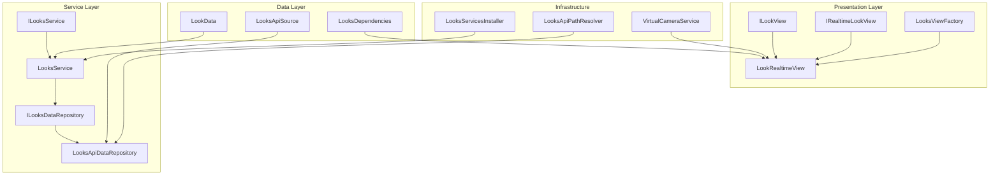

# Genies Looks Package Documentation

**Version:** 1.0.38  
**Unity Version:** 2022.3.32f1 or higher  
**Namespace:** `Genies.Looks`

## Overview

The **Genies Looks** package provides a comprehensive system for managing and displaying avatar appearance configurations called "looks". A look represents a complete avatar setup including visual appearance, animations, media assets, and metadata. This package implements a service-oriented architecture with data repositories, view management, and API integration for both local and remote operations.

## Package Structure

```
Genies.Looks/
├── Runtime/
│   ├── Model/              # Core data models
│   ├── Service/            # Business logic and API services  
│   ├── Views/              # Presentation and rendering components
│   └── Resources/          # Prefab assets and configurations
├── Tests/
│   └── Editor/             # Unit and integration tests
└── Documentation/
    └── Genies Looks.md     # This documentation
```

## Key Features

### 🎭 **Look Management**
- Complete avatar appearance configuration system
- Metadata tracking (creation dates, ownership, export status)
- Animation integration for dynamic looks
- Media asset management (thumbnails, videos)

### 🔄 **Service Architecture**
- Repository pattern for data access abstraction
- Support for both local and remote data sources
- Asynchronous operations with UniTask integration
- Comprehensive error handling and logging

### 📱 **View System**
- Flexible view interfaces for different use cases
- Real-time look preview capabilities
- Virtual camera integration
- Factory pattern for view creation

### 🧪 **Testing Support**
- Comprehensive test suite with NUnit integration
- Mock data repositories for testing
- Local development environment support

## Architecture Overview



## Core Components

### Data Model

#### `LookData` Struct
The primary data structure representing an avatar look:

```csharp
public struct LookData
{
    public string Id { get; set; }                    // Unique identifier
    public string UserId { get; set; }                // Owner user ID
    public decimal? CreatedAt { get; set; }           // Creation timestamp
    public decimal? LastModified { get; set; }        // Last modification timestamp
    public decimal? ExportedAt { get; set; }          // Export timestamp
    public string AvatarDefinition { get; set; }      // Avatar configuration JSON
    public string AnimationId { get; set; }           // Associated animation ID
    public string ThumbnailUrl { get; set; }          // Preview thumbnail URL
    public string VideoUrl { get; set; }              // Preview video URL
    // ... additional metadata properties
}
```

**Key Features:**
- **Immutable Design**: Value type with explicit property setters
- **JSON Serialization**: Full Newtonsoft.Json support for API integration
- **Metadata Rich**: Comprehensive tracking of creation, modification, and export states
- **Media Integration**: Built-in support for thumbnail and video previews

### Service Layer

#### `ILooksService` Interface
The primary service interface for look management operations:

```csharp
public interface ILooksService
{
    // Initialization
    UniTask Initialize();
    
    // Look Retrieval
    UniTask<LookData> GetLastModifiedLook();
    UniTask<LookData> GetLastCreatedLook();
    UniTask<LookData> GetLookById(string id);
    UniTask<List<LookData>> GetLooks(int limit = 10);
    
    // Look Management  
    UniTask<LookData> CreateLook(LookData lookData);
    UniTask<LookData> UpdateLook(LookData lookData);
    UniTask DeleteLook(string lookId);
    
    // Bulk Operations
    UniTask<List<LookData>> CreateLooks(List<LookData> lookDataList);
    UniTask<List<LookData>> UpdateLooks(List<LookData> lookDataList);
    
    // Export Operations
    UniTask<LookData> ExportLook(string lookId);
    UniTask<List<LookData>> ExportLooks(List<string> lookIds);
}
```

**Service Features:**
- **Asynchronous Operations**: All methods return `UniTask` for non-blocking execution
- **Comprehensive CRUD**: Full Create, Read, Update, Delete operations
- **Bulk Processing**: Efficient batch operations for multiple looks
- **Export Management**: Specialized export functionality for finalized looks

#### `LooksService` Implementation
Concrete service implementation with the following capabilities:

- **Repository Integration**: Uses `ILooksDataRepository` for data access abstraction
- **Error Handling**: Comprehensive exception handling with custom `LookServiceException`
- **Logging**: Integrated crash reporting and debug logging
- **Caching**: In-memory caching for performance optimization

### Data Repository Layer

#### `ILooksDataRepository` Interface
Abstraction layer for data access operations:

```csharp
public interface ILooksDataRepository : IDataRepository<LookData>
{
    // Inherits standard repository operations:
    // - GetAsync(string id)
    // - GetAllAsync()
    // - CreateAsync(LookData data)
    // - UpdateAsync(LookData data)
    // - DeleteAsync(string id)
    
    // Look-specific operations
    UniTask<LookData> GetLastModifiedAsync();
    UniTask<LookData> GetLastCreatedAsync();
    UniTask<List<LookData>> GetLooksAsync(int limit);
}
```

#### Available Repository Implementations

**`LooksApiDataRepository`**
- **Purpose**: Remote API data access via HTTP/REST
- **Features**: Full API integration with authentication and error handling
- **Configuration**: Uses `LooksApiPathResolver` for endpoint management
- **Performance**: Implements caching and request optimization

**Local Repository** (for development/testing)
- **Purpose**: Local data storage for offline development
- **Features**: File-based or in-memory storage for testing scenarios
- **Configuration**: Configurable via `LooksApiSource.Local`

### View System

#### `ILookView` Interface
Core interface for look display and interaction:

```csharp
public interface ILookView
{
    string Id { get; }
    
    // Look Management
    UniTask SetDefinition(LookData look);
    UniTask<LookData> GetDefinition();
    
    // Visual Management
    UniTask LoadThumbnail();
    UniTask<Texture2D> GetThumbnail();
    UniTask SetVisibility(bool visible);
}
```

#### `IRealtimeLookView` Interface
Extended interface for real-time look preview and interaction:

```csharp
public interface IRealtimeLookView : ILookView
{
    // Real-time Updates
    UniTask UpdateLookRealtime(LookData lookData);
    
    // Camera Integration
    UniTask FocusCamera();
    UniTask ReleaseCameraFocus();
}
```

#### `LookRealtimeView` Implementation
Concrete implementation providing:

- **Real-time Preview**: Live updates of look changes
- **Camera Integration**: Virtual camera system for optimal viewing
- **Performance Optimization**: Efficient rendering and update cycles
- **Asset Management**: Automatic loading and unloading of visual assets

#### `LooksViewFactory`
Factory class for creating view instances:

```csharp
public static class LooksViewFactory
{
    public static ILookView CreateLookView(LookData lookData);
    public static IRealtimeLookView CreateRealtimeLookView(LookData lookData);
}
```

## Configuration and Setup

### Dependency Injection Setup

The package uses VContainer for dependency injection. Register services using the provided installer:

```csharp
// Automatic registration via AutoResolve attribute
[AutoResolve]
public class LooksServicesInstaller : IGeniesInstaller
{
    public void Install(IContainerBuilder builder)
    {
        builder.Register<ILooksService, LooksService>(Lifetime.Singleton);
        // Additional service registrations...
    }
}
```

### API Source Configuration

Configure the data source using the `LooksApiSource` enum:

```csharp
public enum LooksApiSource
{
    Local,    // For development and testing
    Backend   // For production API integration
}
```

### Virtual Camera Setup

The package integrates with the Genies Camera System for optimal look presentation:

```csharp
public class VirtualCameraService
{
    public Camera ActiveCamera { get; }
    // Camera management methods...
}
```

## Usage Examples

### Basic Look Management

```csharp
// Initialize the looks service
public class LookManager : MonoBehaviour
{
    [Inject] private ILooksService _looksService;
    
    private async void Start()
    {
        await _looksService.Initialize();
        
        // Get the user's latest look
        var latestLook = await _looksService.GetLastModifiedLook();
        Debug.Log($"Latest look: {latestLook.Id}");
        
        // Load all recent looks
        var recentLooks = await _looksService.GetLooks(limit: 5);
        Debug.Log($"Found {recentLooks.Count} recent looks");
    }
}
```

### Creating and Updating Looks

```csharp
public class LookCreator : MonoBehaviour
{
    [Inject] private ILooksService _looksService;
    
    public async UniTask CreateNewLook(string avatarDefinition)
    {
        var newLook = new LookData
        {
            Id = Guid.NewGuid().ToString(),
            AvatarDefinition = avatarDefinition,
            AnimationId = "default_animation",
            CreatedAt = DateTimeOffset.UtcNow.ToUnixTimeMilliseconds()
        };
        
        try
        {
            var createdLook = await _looksService.CreateLook(newLook);
            Debug.Log($"Created look with ID: {createdLook.Id}");
        }
        catch (LookServiceException ex)
        {
            Debug.LogError($"Failed to create look: {ex.Message}");
        }
    }
    
    public async UniTask UpdateExistingLook(string lookId, string newAvatarDefinition)
    {
        var existingLook = await _looksService.GetLookById(lookId);
        existingLook.AvatarDefinition = newAvatarDefinition;
        existingLook.LastModified = DateTimeOffset.UtcNow.ToUnixTimeMilliseconds();
        
        var updatedLook = await _looksService.UpdateLook(existingLook);
        Debug.Log($"Updated look: {updatedLook.Id}");
    }
}
```

### Using the View System

```csharp
public class LookPreview : MonoBehaviour
{
    private IRealtimeLookView _lookView;
    
    public async UniTask ShowLookPreview(LookData lookData)
    {
        // Create a real-time look view
        _lookView = LooksViewFactory.CreateRealtimeLookView(lookData);
        
        // Set the look definition
        await _lookView.SetDefinition(lookData);
        
        // Load and display thumbnail
        await _lookView.LoadThumbnail();
        var thumbnail = await _lookView.GetThumbnail();
        
        // Focus camera on the look
        await _lookView.FocusCamera();
        
        // Make visible
        await _lookView.SetVisibility(true);
    }
    
    public async UniTask UpdatePreview(LookData updatedLookData)
    {
        if (_lookView != null)
        {
            await _lookView.UpdateLookRealtime(updatedLookData);
        }
    }
}
```

### Bulk Operations

```csharp
public class LookBatchProcessor : MonoBehaviour
{
    [Inject] private ILooksService _looksService;
    
    public async UniTask ProcessMultipleLooks(List<LookData> lookDataList)
    {
        try
        {
            // Create multiple looks in batch
            var createdLooks = await _looksService.CreateLooks(lookDataList);
            Debug.Log($"Created {createdLooks.Count} looks");
            
            // Export all created looks
            var lookIds = createdLooks.Select(l => l.Id).ToList();
            var exportedLooks = await _looksService.ExportLooks(lookIds);
            Debug.Log($"Exported {exportedLooks.Count} looks");
        }
        catch (LookServiceException ex)
        {
            Debug.LogError($"Batch operation failed: {ex.Message}");
        }
    }
}
```

## Error Handling

### Custom Exception Types

```csharp
public class LookServiceException : Exception
{
    public LookServiceException(string message) : base(message) { }
    public LookServiceException(string message, Exception innerException) 
        : base(message, innerException) { }
}
```

### Best Practices for Error Handling

```csharp
public async UniTask SafeLookOperation()
{
    try
    {
        var look = await _looksService.GetLookById("some-id");
        // Process look...
    }
    catch (LookServiceException ex)
    {
        // Handle look-specific errors
        Debug.LogError($"Look service error: {ex.Message}");
        // Show user-friendly error message
    }
    catch (TimeoutException ex)
    {
        // Handle timeout scenarios
        Debug.LogWarning("Request timed out, retrying...");
        // Implement retry logic
    }
    catch (Exception ex)
    {
        // Handle unexpected errors
        Debug.LogError($"Unexpected error: {ex.Message}");
        // Report to crash logging system
    }
}
```

## Testing

### Unit Testing Setup

The package includes comprehensive unit tests using NUnit framework:

```csharp
[TestFixture]
public class LooksServiceTests
{
    private ILooksService _looksService;
    private Mock<ILooksDataRepository> _mockRepository;
    
    [SetUp]
    public void Setup()
    {
        _mockRepository = new Mock<ILooksDataRepository>();
        _looksService = new LooksService(_mockRepository.Object);
    }
    
    [Test]
    public async Task CreateLook_ValidData_ReturnsCreatedLook()
    {
        // Arrange
        var lookData = new LookData { Id = "test-id" };
        _mockRepository.Setup(r => r.CreateAsync(lookData))
                      .ReturnsAsync(lookData);
        
        // Act
        var result = await _looksService.CreateLook(lookData);
        
        // Assert
        Assert.AreEqual("test-id", result.Id);
        _mockRepository.Verify(r => r.CreateAsync(lookData), Times.Once);
    }
}
```

### Integration Testing

For integration testing, use the local data source configuration:

```csharp
[Test]
public async Task IntegrationTest_CreateAndRetrieveLook()
{
    // Configure for local testing
    var localService = new LooksService(isLocal: true);
    await localService.Initialize();
    
    // Create test look
    var testLook = CreateTestLookData();
    var createdLook = await localService.CreateLook(testLook);
    
    // Verify retrieval
    var retrievedLook = await localService.GetLookById(createdLook.Id);
    Assert.AreEqual(createdLook.Id, retrievedLook.Id);
}
```

## Dependencies

The Genies Looks package depends on several other Genies packages and external libraries:

### Core Dependencies
- **com.genies.avatars** (2.0.2): Avatar system integration
- **com.genies.animations** (2.0.2): Animation system integration
- **com.genies.services** (2.0.11): Base service infrastructure
- **com.genies.servicemanagement** (1.1.1): Dependency injection framework

### Utility Dependencies
- **com.genies.thirdparty.unitask** (1.1.0): Asynchronous operation support
- **com.genies.datarepositoryframework** (1.0.1): Repository pattern implementation
- **com.genies.thirdparty.vcontainer** (1.1.1): Dependency injection container

### Testing Dependencies
- **com.unity.test-framework** (1.1.33): Unity testing framework
- **com.genies.thirdparty.nsubstitute** (1.1.0): Mocking framework for tests

## Best Practices

### Service Usage
- **Initialize Once**: Always call `Initialize()` before using other service methods
- **Error Handling**: Implement proper try-catch blocks for all service calls
- **Resource Cleanup**: Dispose of views and textures when no longer needed

### Performance
- **Batch Operations**: Use bulk methods when processing multiple looks
- **Caching**: Leverage built-in caching mechanisms effectively
- **Async Patterns**: Always use async/await patterns with UniTask

### Testing
- **Mock Dependencies**: Use dependency injection for testable code
- **Integration Tests**: Include integration tests for critical workflows
- **Local Development**: Use local data sources for development and testing

## Conclusion

The **Genies Looks** package provides a comprehensive, production-ready system for managing avatar appearance configurations. Its service-oriented architecture, flexible view system, and robust error handling make it suitable for both simple implementations and complex, scalable applications.

For additional support or questions, please refer to the package changelog or contact the Genies engineering team.