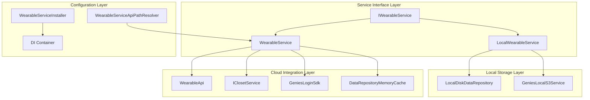

# Genies Wearable Package Documentation

**Version:** 1.0.32  
**Unity Version:** 2022.3.32f1 or higher  
**Namespace:** `Genies.Wearables`

## Overview

The **Genies Wearable** package provides comprehensive wearable management services within the Genies ecosystem. This package enables the creation, retrieval, storage, and management of user-generated wearable content, supporting both cloud-based and local storage implementations. It integrates seamlessly with the Genies Closet system, authentication services, and UGC (User-Generated Content) framework to provide a complete wearable management solution.

## Key Features

### 🎨 **Wearable Creation and Customization**
- Create custom wearables from UGC templates with unique configurations
- Support for wearable icons and visual representations
- Template-based wearable generation with category-specific handling
- Thriftable wearable support for community sharing and trading
- Update existing wearables with new configurations and metadata

### ☁️ **Dual Storage Architecture**
- **Cloud-based Service**: Full API integration with Genies backend services
- **Local Storage Service**: Offline-capable local disk storage implementation
- Seamless switching between storage modes for development and production
- Memory caching for optimal performance and reduced API calls
- Automatic data synchronization with closet service integration

### 🔍 **Advanced Wearable Retrieval**
- Single and batch wearable retrieval operations
- Efficient caching system to minimize API calls and improve performance
- Comprehensive wearable metadata including creation timestamps and categories
- Support for thrift shop browsing and wearable discovery
- Owner-specific wearable collection management

### 🛠️ **Service Integration Architecture**
- Service-oriented design with dependency injection support
- Integration with Genies authentication system for user management
- Closet service integration for wearable collection organization
- S3 service integration for asset storage and retrieval
- Environment-specific API configuration for development flexibility

### ⚡ **Performance Optimization**
- Memory-based caching with intelligent cache management
- Batch API operations for efficient network usage
- Paginated request handling for large wearable collections
- Asynchronous operations using UniTask for responsive UI
- Automatic cache invalidation and refresh mechanisms

## Core Architecture



## Core Components

### Service Interface: `IWearableService`

The central interface defining all wearable management operations:

```csharp
public interface IWearableService
{
    // Wearable Creation
    UniTask<string> CreateWearableAsync(Ugc.Wearable wearable, byte[] icon, 
                                       string wearableId = null, 
                                       bool isThriftable = true);
    
    // Wearable Retrieval
    UniTask<Services.Model.Wearable> GetWearableByIdAsync(string id);
    UniTask<List<Services.Model.Wearable>> GetWearablesByIdsAsync(List<string> ids);
    UniTask<List<Services.Model.Wearable>> GetAllOwnedWearablesAsync();
    UniTask<List<string>> GetAllOwnedWearableIds();
    
    // Thrift Shop Integration
    UniTask<WearableThriftList> GetThriftableWearbles(string userId);
    
    // Cache Management
    void ClearCache();
}
```

### Cloud Service Implementation: `WearableService`

The primary cloud-based implementation with full API integration:

```csharp
public sealed class WearableService : IWearableService
{
    // Dependency Injection Constructor
    [Inject]
    public WearableService(IClosetService closetService)
    
    // Direct Constructor with User ID
    public WearableService(string userId, IClosetService closetService)
    
    // Implementation of all IWearableService methods
    // with API integration and caching
}
```

**Service Features:**
- **API Integration**: Full integration with Genies wearable API endpoints
- **Authentication Support**: Automatic user authentication and token management
- **Memory Caching**: Intelligent caching system with record-based storage
- **Closet Integration**: Automatic wearable addition to user's closet collection
- **Environment Awareness**: Support for different backend environments (Dev, QA, Prod)
- **Error Handling**: Comprehensive error handling with logging and fallback mechanisms

### Local Storage Implementation: `LocalWearableService`

Offline-capable implementation using local disk storage:

```csharp
public class LocalWearableService : IWearableService
{
    // Local storage repository for wearable data
    private readonly LocalDiskDataRepository<LocalWearable> _wearablesStorage;
    
    // Local S3 service for icon storage
    private readonly GeniesLocalS3Service _localS3Service;
    
    // Implementation of all IWearableService methods
    // with local storage and file system operations
}
```

**Local Service Features:**
- **Offline Support**: Complete functionality without network connectivity
- **Local Storage**: Persistent local disk storage using repository pattern
- **Icon Management**: Local S3 service for wearable icon storage and retrieval
- **GUID Generation**: Automatic unique identifier generation for local wearables
- **JSON Serialization**: Efficient wearable data serialization and deserialization
- **Development Support**: Ideal for development and testing scenarios

## Usage Examples

### Basic Wearable Management

```csharp
public class WearableManager : MonoBehaviour
{
    private IWearableService _wearableService;
    
    private async void Start()
    {
        await InitializeWearableService();
        await DemoWearableOperations();
    }
    
    private async UniTask InitializeWearableService()
    {
        // Service resolved through dependency injection
        _wearableService = ServiceManager.Resolve<IWearableService>();
        Debug.Log("Wearable service initialized");
    }
    
    private async UniTask DemoWearableOperations()
    {
        await CreateCustomWearable();
        await RetrieveUserWearables();
        await ExploreThriftShop();
    }
    
    private async UniTask CreateCustomWearable()
    {
        // Create UGC wearable definition
        var ugcWearable = new Ugc.Wearable
        {
            TemplateId = "shirt-casual-001",
            // Configure wearable properties
        };
        
        // Load wearable icon
        var iconTexture = await LoadWearableIcon("casual_shirt_icon.png");
        var iconBytes = iconTexture.EncodeToPNG();
        
        try
        {
            // Create the wearable
            string wearableId = await _wearableService.CreateWearableAsync(
                ugcWearable, 
                iconBytes, 
                wearableId: null, // null for new creation
                isThriftable: true // Allow other users to thrift
            );
            
            if (!string.IsNullOrEmpty(wearableId))
            {
                Debug.Log($"Successfully created wearable: {wearableId}");
            }
        }
        catch (Exception ex)
        {
            Debug.LogError($"Error creating wearable: {ex.Message}");
        }
    }
    
    private async UniTask RetrieveUserWearables()
    {
        try
        {
            // Get all owned wearables
            var ownedWearables = await _wearableService.GetAllOwnedWearablesAsync();
            
            Debug.Log($"User owns {ownedWearables.Count} wearables");
            
            // Display wearable collection
            foreach (var wearable in ownedWearables.Take(5)) // Show first 5
            {
                Debug.Log($"Wearable: {wearable.DisplayName} (Category: {wearable.Category})");
            }
        }
        catch (Exception ex)
        {
            Debug.LogError($"Error retrieving wearables: {ex.Message}");
        }
    }
    
    private async UniTask ExploreThriftShop()
    {
        try
        {
            // Browse another user's thrift shop
            string targetUserId = "example-user-id";
            var thriftList = await _wearableService.GetThriftableWearbles(targetUserId);
            
            if (thriftList != null)
            {
                Debug.Log($"Found {thriftList.Wearables.Count} thriftable wearables");
            }
        }
        catch (Exception ex)
        {
            Debug.LogError($"Error exploring thrift shop: {ex.Message}");
        }
    }
    
    private async UniTask<Texture2D> LoadWearableIcon(string iconPath)
    {
        // Load icon from Resources or create default
        var iconTexture = Resources.Load<Texture2D>($"WearableIcons/{iconPath}");
        
        if (iconTexture == null)
        {
            iconTexture = CreateDefaultWearableIcon();
        }
        
        return iconTexture;
    }
    
    private Texture2D CreateDefaultWearableIcon()
    {
        var texture = new Texture2D(256, 256);
        var colors = new Color[256 * 256];
        
        for (int i = 0; i < colors.Length; i++)
        {
            colors[i] = new Color(0.5f, 0.7f, 1f, 1f);
        }
        
        texture.SetPixels(colors);
        texture.Apply();
        
        return texture;
    }
}
```

## Package Structure

```
Genies.Wearable/
├── Runtime/
│   ├── IWearableService.cs              # Core service interface
│   ├── WearableService.cs               # Cloud-based implementation
│   ├── LocalWearableService.cs          # Local storage implementation
│   ├── WearableServiceApiPathResolver.cs # API endpoint configuration
│   ├── WearableServiceInstaller.cs      # Dependency injection setup
│   └── Genies.Wearables.asmdef          # Assembly definition
└── Documentation/
    └── Genies Wearable.md               # Package documentation
```

## Dependencies

### Core Dependencies
- **com.genies.thirdparty.unitask** (1.1.0): Asynchronous operations and task management
- **com.genies.closet** (1.1.15): User wearable collection management and organization
- **com.genies.datarepositoryframework** (1.0.1): Data storage and caching infrastructure
- **com.genies.login.native** (1.7.1): User authentication and session management
- **com.genies.s3service** (1.0.9): Asset storage and retrieval services
- **com.genies.servicemanagement** (1.1.1): Dependency injection and service architecture
- **com.genies.services** (2.0.15): Core API services and client infrastructure
- **com.genies.thirdparty.vcontainer** (1.1.1): Dependency injection container
- **com.genies.ugc** (2.0.12): User-generated content framework and models
- **com.genies.utilities** (1.6.0): Utility functions and extension methods
- **com.genies.login** (1.3.3): Authentication interfaces and contracts

## Integration with Genies Ecosystem

### Service Management Integration

```csharp
public class WearableIntegrationExample : MonoBehaviour
{
    private async void Start()
    {
        // Services are automatically injected through the container
        var wearableService = ServiceManager.Resolve<IWearableService>();
        var closetService = ServiceManager.Resolve<IClosetService>();
        
        // Services work together seamlessly
        await DemoServiceIntegration(wearableService, closetService);
    }
    
    private async UniTask DemoServiceIntegration(
        IWearableService wearableService, 
        IClosetService closetService)
    {
        // Create wearable - automatically added to closet
        var ugcWearable = new Ugc.Wearable { TemplateId = "integration-test" };
        var iconBytes = new byte[] { /* icon data */ };
        
        var wearableId = await wearableService.CreateWearableAsync(ugcWearable, iconBytes);
        
        // Verify closet integration
        var closetItems = await closetService.GetClosetItems();
        var addedWearable = closetItems.Wearables.FirstOrDefault(w => w.WearableId == wearableId);
        
        if (addedWearable != null)
        {
            Debug.Log("Wearable successfully integrated with closet system");
        }
    }
}
```

### Authentication Integration

```csharp
public class WearableAuthIntegration : MonoBehaviour
{
    private IWearableService _wearableService;
    
    private async void Start()
    {
        await SetupAuthenticatedWearableService();
    }
    
    private async UniTask SetupAuthenticatedWearableService()
    {
        // Wait for user authentication
        await UniTask.WaitUntil(() => GeniesLoginSdk.IsUserSignedIn());
        
        // Service automatically uses authenticated user context
        _wearableService = ServiceManager.Resolve<IWearableService>();
        
        var userId = await GeniesLoginSdk.GetUserIdAsync();
        Debug.Log($"Wearable service ready for user: {userId}");
        
        // All operations are user-specific
        var userWearables = await _wearableService.GetAllOwnedWearablesAsync();
        Debug.Log($"User has {userWearables.Count} wearables");
    }
}
```

## Best Practices

### Wearable Creation Best Practices
- **Template Validation**: Always validate template IDs before creating wearables
- **Icon Quality**: Provide high-quality icons for better user experience
- **Metadata Completeness**: Include comprehensive wearable metadata
- **Category Consistency**: Use consistent category naming across templates
- **Error Handling**: Implement robust error handling for network failures

### Performance Optimization
- **Batch Operations**: Use batch retrieval methods when working with multiple wearables
- **Cache Management**: Leverage caching for frequently accessed wearables
- **Pagination**: Implement pagination for large wearable collections
- **Async Patterns**: Use UniTask consistently for non-blocking operations
- **Memory Management**: Clear caches appropriately to prevent memory buildup

### Service Integration
- **Dependency Injection**: Use the service management system for clean dependency injection
- **Interface Programming**: Program against IWearableService interface for flexibility
- **Environment Awareness**: Configure services appropriately for different environments
- **Local Development**: Use LocalWearableService for offline development and testing
- **Error Boundaries**: Implement proper error boundaries between service integrations

### Development Workflow
- **Local Testing**: Start development with LocalWearableService for faster iteration
- **Environment Progression**: Test through Dev → QA → Prod environments systematically
- **Cache Testing**: Test both cache hits and misses in your scenarios
- **Integration Testing**: Verify wearable service integration with closet and authentication
- **Performance Monitoring**: Monitor cache effectiveness and API response times

## Conclusion

The **Genies Wearable** package provides a comprehensive, flexible, and performant solution for wearable management within the Genies ecosystem. Its dual-architecture approach with cloud-based and local storage implementations offers developers the flexibility to work in various environments while maintaining consistent APIs and functionality.

The package's integration with the broader Genies ecosystem—including authentication, closet management, UGC framework, and service management—ensures seamless operation within the platform. The comprehensive caching system, batch operations support, and async-first design provide excellent performance characteristics for both development and production environments.

Whether you're developing new wearable creation tools, building user closet interfaces, or implementing thrift shop functionality, this package provides all the necessary tools and services to create compelling wearable experiences within the Genies platform.

For additional support, advanced integration scenarios, or questions about wearable service implementation, please refer to the package changelog or contact the Genies engineering team.
